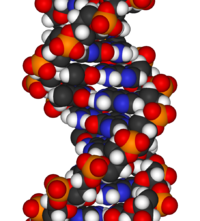
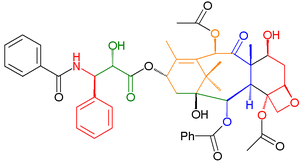

<h2><em>The Chemistry Portal</em></h2>

<strong>Introduction</strong>

&nbsp;

An oil painting of a chemist (by&nbsp;<a title="Henrika &Scaron;antel" href="https://en.wikipedia.org/wiki/Henrika_%C5%A0antel">Henrika &Scaron;antel</a>&nbsp;in 1932)

&nbsp;

<strong><a title="Chemistry" href="https://en.wikipedia.org/wiki/Chemistry">Chemistry</a></strong>&nbsp;is the&nbsp;<a class="mw-redirect" title="Scientific discipline" href="https://en.wikipedia.org/wiki/Scientific_discipline">scientific discipline</a>&nbsp;involved with&nbsp;<a title="Chemical element" href="https://en.wikipedia.org/wiki/Chemical_element">elements</a>&nbsp;and&nbsp;<a title="Chemical compound" href="https://en.wikipedia.org/wiki/Chemical_compound">compounds</a>&nbsp;composed of&nbsp;<a title="Atom" href="https://en.wikipedia.org/wiki/Atom">atoms</a>,&nbsp;<a title="Molecule" href="https://en.wikipedia.org/wiki/Molecule">molecules</a>&nbsp;and&nbsp;<a title="Ion" href="https://en.wikipedia.org/wiki/Ion">ions</a>: their composition, structure, properties, behavior and the changes they undergo during a&nbsp;<a title="Chemical reaction" href="https://en.wikipedia.org/wiki/Chemical_reaction">reaction</a>&nbsp;with other&nbsp;<a title="Chemical substance" href="https://en.wikipedia.org/wiki/Chemical_substance">substances</a>.

In the scope of its subject, chemistry occupies an intermediate position between&nbsp;<a title="Physics" href="https://en.wikipedia.org/wiki/Physics">physics</a>&nbsp;and&nbsp;<a title="Biology" href="https://en.wikipedia.org/wiki/Biology">biology</a>. It is sometimes called&nbsp;<a title="The central science" href="https://en.wikipedia.org/wiki/The_central_science">the central science</a>&nbsp;because it provides a foundation for understanding both&nbsp;<a title="Basic research" href="https://en.wikipedia.org/wiki/Basic_research">basic</a>&nbsp;and&nbsp;<a title="Applied science" href="https://en.wikipedia.org/wiki/Applied_science">applied</a>&nbsp;scientific disciplines at a fundamental level. For example, chemistry explains aspects of plant chemistry (<a title="Botany" href="https://en.wikipedia.org/wiki/Botany">botany</a>), the formation of igneous rocks (<a title="Geology" href="https://en.wikipedia.org/wiki/Geology">geology</a>), how atmospheric ozone is formed and how environmental pollutants are degraded (<a title="Ecology" href="https://en.wikipedia.org/wiki/Ecology">ecology</a>), the properties of the soil on the moon (<a title="Astrophysics" href="https://en.wikipedia.org/wiki/Astrophysics">astrophysics</a>), how medications work (<a title="Pharmacology" href="https://en.wikipedia.org/wiki/Pharmacology">pharmacology</a>), and how to collect&nbsp;<a title="DNA" href="https://en.wikipedia.org/wiki/DNA">DNA</a>&nbsp;evidence at a crime scene (<a class="mw-redirect" title="Forensic" href="https://en.wikipedia.org/wiki/Forensic">forensics</a>).

Chemistry addresses topics such as how atoms and molecules interact via&nbsp;<a title="Chemical bond" href="https://en.wikipedia.org/wiki/Chemical_bond">chemical bonds</a>&nbsp;to form new&nbsp;<a title="Chemical compound" href="https://en.wikipedia.org/wiki/Chemical_compound">chemical compounds</a>. There are four types of chemical bonds:&nbsp;<a class="mw-redirect" title="Covalent" href="https://en.wikipedia.org/wiki/Covalent">covalent</a>&nbsp;bonds, in which compounds share one or more electron(s);&nbsp;<a class="mw-redirect" title="Ionic bond" href="https://en.wikipedia.org/wiki/Ionic_bond">ionic bonds</a>, in which a compound donates one or more&nbsp;<a title="Electron" href="https://en.wikipedia.org/wiki/Electron">electrons</a>&nbsp;to another compound to produce&nbsp;<a title="Ion" href="https://en.wikipedia.org/wiki/Ion">ions</a>&nbsp;(<a class="mw-redirect" title="Cation" href="https://en.wikipedia.org/wiki/Cation">cations</a>&nbsp;and&nbsp;<a class="mw-redirect" title="Anion" href="https://en.wikipedia.org/wiki/Anion">anions</a>);&nbsp;<a title="Hydrogen bond" href="https://en.wikipedia.org/wiki/Hydrogen_bond">hydrogen bonds</a>; and&nbsp;<a title="Van der Waals force" href="https://en.wikipedia.org/wiki/Van_der_Waals_force">Van der Waals force</a>&nbsp;bonds.

<strong><a title="Chemistry" href="https://en.wikipedia.org/wiki/Chemistry">Read more...</a></strong>

&nbsp;

&nbsp;

<strong>Deoxyribonucleic acid</strong>&nbsp;(<strong><a title="DNA" href="https://en.wikipedia.org/wiki/DNA">DNA</a></strong>) is a&nbsp;<a title="Nucleic acid" href="https://en.wikipedia.org/wiki/Nucleic_acid">nucleic acid</a>&nbsp;that contains the&nbsp;<a title="Genetics" href="https://en.wikipedia.org/wiki/Genetics">genetic</a>&nbsp;instructions for the development and function of living organisms. All living things contain DNA, with the exception of some&nbsp;<a title="Virus" href="https://en.wikipedia.org/wiki/Virus">viruses</a>&nbsp;with&nbsp;<a title="Retrovirus" href="https://en.wikipedia.org/wiki/Retrovirus">RNA genomes</a>. The main role of DNA in the&nbsp;<a title="Cell (biology)" href="https://en.wikipedia.org/wiki/Cell_(biology)">cell</a>&nbsp;is the long term storage of information. It is often compared to a blueprint, since it contains the instructions to construct other components of the cell, such as&nbsp;<a title="Protein" href="https://en.wikipedia.org/wiki/Protein">proteins</a>&nbsp;and&nbsp;<a title="RNA" href="https://en.wikipedia.org/wiki/RNA">RNA</a>&nbsp;molecules. The DNA segments that carry genetic information are called&nbsp;<em><a title="Gene" href="https://en.wikipedia.org/wiki/Gene">genes</a></em>, but other DNA sequences have structural purposes, or are involved in regulating the expression of genetic information.

DNA is a long&nbsp;<a title="Polymer" href="https://en.wikipedia.org/wiki/Polymer">polymer</a>&nbsp;of simple units called&nbsp;<a title="Nucleotide" href="https://en.wikipedia.org/wiki/Nucleotide">nucleotides</a>, which are held together by a backbone made of sugars and phosphate groups. This backbone carries four types of molecules called&nbsp;<a title="Nucleobase" href="https://en.wikipedia.org/wiki/Nucleobase">bases</a>&nbsp;and it is the sequence of these four bases that encodes information. The major function of DNA is to encode the sequence of&nbsp;<a class="mw-redirect" title="Amino acid residue" href="https://en.wikipedia.org/wiki/Amino_acid_residue">amino acid residues</a>&nbsp;in&nbsp;<a title="Protein" href="https://en.wikipedia.org/wiki/Protein">proteins</a>, using the&nbsp;<a title="Genetic code" href="https://en.wikipedia.org/wiki/Genetic_code">genetic code</a>. To read the genetic code, cells make a copy of a stretch of DNA in the nucleic acid&nbsp;<a title="RNA" href="https://en.wikipedia.org/wiki/RNA">RNA</a>. These RNA copies can then be used to direct&nbsp;<a class="mw-redirect" title="Protein synthesis" href="https://en.wikipedia.org/wiki/Protein_synthesis">protein synthesis</a>, but they can also be used directly as parts of&nbsp;<a title="Ribosome" href="https://en.wikipedia.org/wiki/Ribosome">ribosomes</a>&nbsp;or&nbsp;<a title="Spliceosome" href="https://en.wikipedia.org/wiki/Spliceosome">spliceosomes</a>.

<a class="mw-redirect" title="James D. Watson" href="https://en.wikipedia.org/wiki/James_D._Watson">James D. Watson</a>&nbsp;and&nbsp;<a title="Francis Crick" href="https://en.wikipedia.org/wiki/Francis_Crick">Francis Crick</a>&nbsp;produced the first accurate model of DNA structure in 1953 in their article&nbsp;<a class="mw-redirect" title="Molecular structure of Nucleic Acids" href="https://en.wikipedia.org/wiki/Molecular_structure_of_Nucleic_Acids">The Molecular structure of Nucleic Acids</a>. Watson and Crick proposed the&nbsp;<a class="mw-redirect" title="Central dogma" href="https://en.wikipedia.org/wiki/Central_dogma">central dogma</a>&nbsp;of molecular biology in 1957, describing how proteins are produced from&nbsp;<a title="Cell nucleus" href="https://en.wikipedia.org/wiki/Cell_nucleus">nucleic</a>&nbsp;DNA. In 1962 Watson, Crick, and&nbsp;<a title="Maurice Wilkins" href="https://en.wikipedia.org/wiki/Maurice_Wilkins">Maurice Wilkins</a>&nbsp;jointly received the&nbsp;<a title="Nobel Prize" href="https://en.wikipedia.org/wiki/Nobel_Prize">Nobel Prize</a>.

<table class="noprint" border="0" width="100%">
<tbody>
<tr>
<td>

<strong><a title="DNA" href="https://en.wikipedia.org/wiki/DNA">Read more...</a></strong>

</td>
</tr>
</tbody>
</table>

&nbsp;

<h2>Subcategories</h2>

<strong><a title="Category:Chemistry" href="https://en.wikipedia.org/wiki/Category:Chemistry">Fields of Chemistry</a></strong>&nbsp;(<a title="Category:Wikipedia books on chemistry" href="https://en.wikipedia.org/wiki/Category:Wikipedia_books_on_chemistry">books</a>)

<ul>
<li><a title="Category:Analytical chemistry" href="https://en.wikipedia.org/wiki/Category:Analytical_chemistry">Analytical chemistry</a>:&nbsp;<a title="Category:Chromatography" href="https://en.wikipedia.org/wiki/Category:Chromatography">Chromatography</a>,&nbsp;<a title="Category:Spectroscopy" href="https://en.wikipedia.org/wiki/Category:Spectroscopy">Spectroscopy</a></li>
<li><a title="Category:Biochemistry" href="https://en.wikipedia.org/wiki/Category:Biochemistry">Biochemistry</a>:&nbsp;<a title="Category:Molecular biology" href="https://en.wikipedia.org/wiki/Category:Molecular_biology">Molecular biology</a></li>
<li><a class="mw-redirect" title="Crystal Chemistry" href="https://en.wikipedia.org/wiki/Crystal_Chemistry">Crystal Chemistry</a></li>
<li><a title="Category:Environmental chemistry" href="https://en.wikipedia.org/wiki/Category:Environmental_chemistry">Environmental chemistry</a>:&nbsp;<a title="Category:Geochemistry" href="https://en.wikipedia.org/wiki/Category:Geochemistry">Geochemistry</a></li>
<li><a title="Category:Inorganic chemistry" href="https://en.wikipedia.org/wiki/Category:Inorganic_chemistry">Inorganic chemistry</a>:&nbsp;<a title="Category:Inorganic reactions" href="https://en.wikipedia.org/wiki/Category:Inorganic_reactions">Inorganic reactions</a></li>
<li><a title="Category:Materials science" href="https://en.wikipedia.org/wiki/Category:Materials_science">Materials science</a>:&nbsp;<a title="Category:Nanotechnology" href="https://en.wikipedia.org/wiki/Category:Nanotechnology">Nanotechnology</a>,&nbsp;<a title="Category:Glass" href="https://en.wikipedia.org/wiki/Category:Glass">Glass</a>,&nbsp;<a title="Category:Ceramics" href="https://en.wikipedia.org/wiki/Category:Ceramics">Ceramics</a></li>
<li><a title="Category:Medicinal chemistry" href="https://en.wikipedia.org/wiki/Category:Medicinal_chemistry">Medicinal chemistry</a></li>
<li><a title="Category:Metallurgy" href="https://en.wikipedia.org/wiki/Category:Metallurgy">Metallurgy</a></li>
<li><a title="Category:Nuclear chemistry" href="https://en.wikipedia.org/wiki/Category:Nuclear_chemistry">Nuclear chemistry</a></li>
<li><a title="Category:Organic chemistry" href="https://en.wikipedia.org/wiki/Category:Organic_chemistry">Organic chemistry</a>:&nbsp;<a title="Category:Functional groups" href="https://en.wikipedia.org/wiki/Category:Functional_groups">Functional groups</a>,&nbsp;<a title="Category:Organic compounds" href="https://en.wikipedia.org/wiki/Category:Organic_compounds">Organic compounds</a>,&nbsp;<a title="Category:Organic reactions" href="https://en.wikipedia.org/wiki/Category:Organic_reactions">Organic reactions</a></li>
<li><a title="Category:Organometallic chemistry" href="https://en.wikipedia.org/wiki/Category:Organometallic_chemistry">Organometallic chemistry</a></li>
<li><a title="Category:Pharmacy" href="https://en.wikipedia.org/wiki/Category:Pharmacy">Pharmacy</a></li>
<li><a title="Category:Physical chemistry" href="https://en.wikipedia.org/wiki/Category:Physical_chemistry">Physical chemistry</a>:&nbsp;<a title="Category:Electrochemistry" href="https://en.wikipedia.org/wiki/Category:Electrochemistry">Electrochemistry</a>,&nbsp;<a title="Category:Quantum chemistry" href="https://en.wikipedia.org/wiki/Category:Quantum_chemistry">Quantum chemistry</a></li>
<li><a title="Category:Polymer chemistry" href="https://en.wikipedia.org/wiki/Category:Polymer_chemistry">Polymer chemistry</a></li>
<li><a title="Category:Supramolecular chemistry" href="https://en.wikipedia.org/wiki/Category:Supramolecular_chemistry">Supramolecular chemistry</a></li>
<li><a title="Category:Theoretical chemistry" href="https://en.wikipedia.org/wiki/Category:Theoretical_chemistry">Theoretical chemistry</a>:&nbsp;<a title="Category:Computational chemistry" href="https://en.wikipedia.org/wiki/Category:Computational_chemistry">Computational chemistry</a></li>
</ul>

&nbsp;

<h2>History and Philosophy of Chemistry</h2>

Many chemists have an interest in the&nbsp;<a title="History of chemistry" href="https://en.wikipedia.org/wiki/History_of_chemistry">history of chemistry</a>. Those with philosophical interests will be interested that the&nbsp;<a title="Philosophy of chemistry" href="https://en.wikipedia.org/wiki/Philosophy_of_chemistry">philosophy of chemistry</a>&nbsp;has quite recently developed along a path somewhat different from the general&nbsp;<a title="Philosophy of science" href="https://en.wikipedia.org/wiki/Philosophy_of_science">philosophy of science</a>.

Other articles that might interest you are:

<ul>
<li><a class="mw-redirect" title="Superseded scientific theory" href="https://en.wikipedia.org/wiki/Superseded_scientific_theory#Chemistry">Superseded chemistry theories</a></li>
<li><a title="Alchemy" href="https://en.wikipedia.org/wiki/Alchemy">Alchemy</a></li>
<li><a title="Scientific method" href="https://en.wikipedia.org/wiki/Scientific_method">Scientific method</a></li>
<li><a title="The central science" href="https://en.wikipedia.org/wiki/The_central_science">The central science</a></li>
</ul>

&nbsp;

<h3>Chemistry Resources</h3>

<strong><a title="Wikipedia:WikiProject Chemicals/Data" href="https://en.wikipedia.org/wiki/Wikipedia:WikiProject_Chemicals/Data">Wikipedia:WikiProject Chemicals/Data</a></strong>&nbsp;is a collection of links and references that are useful for chemistry-related works. This includes free online&nbsp;<a title="Chemical database" href="https://en.wikipedia.org/wiki/Chemical_database">chemical databases</a>, publications,&nbsp;<a title="Patent" href="https://en.wikipedia.org/wiki/Patent">patents</a>,&nbsp;<a title="Computer program" href="https://en.wikipedia.org/wiki/Computer_program">computer programs</a>, and various tools.

<a class="external text" href="http://www.unit-conversion.info/" rel="nofollow">unit-conversion.info</a>&nbsp;A good place to figure out what equals what.

<a class="external text" href="http://antoine.frostburg.edu/chem/senese/101/index.shtml" rel="nofollow">General Chemistry Online</a>&nbsp;Clear text and comprehensive coverage of general chemistry topics by Fred Senese, Dept. of Chemistry Frostburg State University

<a class="external text" href="http://chemed.chem.purdue.edu/demos/" rel="nofollow">General Chemistry Demonstration at Purdue</a>&nbsp;Video clips (and descriptions) of lecture demonstrations.

<a class="external text" href="http://murov.info/webercises.htm" rel="nofollow">Chemistry Webercises Directory</a>&nbsp;A large listing of chemistry resources maintained by Steven Murov, Emeritus Chemistry Professor Modesto Junior College.

<a class="external text" href="http://www.nyu.edu/pages/mathmol/" rel="nofollow">MathMol</a>&nbsp;MathMol (Mathematics and Molecules) is a good starting point for those interested in the field of molecular modeling.

<a class="external text" href="http://abc-chemistry.org/" rel="nofollow">ABC-Chemistry</a>&nbsp;A directory of free full-text journals in chemistry, biochemistry and related subjects.

<a class="external text" href="http://www.privatehand.com/flash/elements.html" rel="nofollow">The Element Song</a>&nbsp;A goofy little song about all of the elements.

<strong><a title="Portal:Chemistry/Resources" href="https://en.wikipedia.org/wiki/Portal:Chemistry/Resources">Show chemistry resources...</a></strong>

&nbsp;

&nbsp;

<strong><a title="Paclitaxel" href="https://en.wikipedia.org/wiki/Paclitaxel">Paclitaxel</a></strong>&nbsp;is an important drug used for the treatment of&nbsp;<a title="Cancer" href="https://en.wikipedia.org/wiki/Cancer">cancer</a>. Its complex structure provided a challenging target for&nbsp;<a title="Nicolaou Taxol total synthesis" href="https://en.wikipedia.org/wiki/Nicolaou_Taxol_total_synthesis">its total synthesis by the Nicolaou group</a>. The colors indicate the approach they used.

<table class="noprint" border="0" width="100%">
<tbody>
<tr>
<td>

<strong><a title="Paclitaxel" href="https://en.wikipedia.org/wiki/Paclitaxel">Read more...</a></strong>

</td>
</tr>
</tbody>
</table>

&nbsp;

&nbsp;

<strong><a title="Marie Curie" href="https://en.wikipedia.org/wiki/Marie_Curie">Marie Curie</a></strong>&nbsp;(1867-1934) was a Polish physicist and chemist, and a leading figure in the early science of&nbsp;<a class="mw-redirect" title="Radioactivity" href="https://en.wikipedia.org/wiki/Radioactivity">radioactivity</a>. Along with her husband&nbsp;<a title="Pierre Curie" href="https://en.wikipedia.org/wiki/Pierre_Curie">Pierre</a>, she discovered the elements&nbsp;<a title="Radium" href="https://en.wikipedia.org/wiki/Radium">radium</a>&nbsp;and&nbsp;<a title="Polonium" href="https://en.wikipedia.org/wiki/Polonium">polonium</a>. She received the&nbsp;<a title="Nobel Prize in Physics" href="https://en.wikipedia.org/wiki/Nobel_Prize_in_Physics">Nobel Prize in Physics</a>&nbsp;in 1903, along with her husband and&nbsp;<a title="Henri Becquerel" href="https://en.wikipedia.org/wiki/Henri_Becquerel">Henri Becquerel</a>, thus becoming the first woman to earn a&nbsp;<a title="Nobel Prize" href="https://en.wikipedia.org/wiki/Nobel_Prize">Nobel</a>&nbsp;&ndash; 8 years later, she received the&nbsp;<a title="Nobel Prize in Chemistry" href="https://en.wikipedia.org/wiki/Nobel_Prize_in_Chemistry">Nobel Prize in Chemistry</a>, thus becoming the first person to receive 2 Nobel Prizes, and the first to do so in two different fields. The only other scientist to have achieved this feat is&nbsp;<a title="Linus Pauling" href="https://en.wikipedia.org/wiki/Linus_Pauling">Linus Pauling</a>. Her death was from&nbsp;<a title="Aplastic anemia" href="https://en.wikipedia.org/wiki/Aplastic_anemia">aplastic anemia</a>, widely believed to be due to her massive exposure to&nbsp;<a title="Radiation" href="https://en.wikipedia.org/wiki/Radiation">radiation</a>.
<table class="noprint" border="0" width="100%">
<tbody>
<tr>
<td>

<strong><a title="Marie Curie" href="https://en.wikipedia.org/wiki/Marie_Curie">Read more...</a></strong>

</td>
</tr>
</tbody>
</table>

&nbsp;

<h2>Techniques used by chemists</h2>

&nbsp;

<a title="Catalysis" href="https://en.wikipedia.org/wiki/Catalysis">Catalysis</a>&nbsp;-&nbsp;<a title="Chromatography" href="https://en.wikipedia.org/wiki/Chromatography">Chromatography</a>&nbsp;-&nbsp;<a title="Combustion" href="https://en.wikipedia.org/wiki/Combustion">Combustion</a>&nbsp;-&nbsp;<a title="Crystallization" href="https://en.wikipedia.org/wiki/Crystallization">Crystallization</a>&nbsp;-&nbsp;<a title="Decantation" href="https://en.wikipedia.org/wiki/Decantation">Decantation</a>&nbsp;-&nbsp;<a title="Distillation" href="https://en.wikipedia.org/wiki/Distillation">Distillation</a>&nbsp;-&nbsp;<a title="Electrolysis" href="https://en.wikipedia.org/wiki/Electrolysis">Electrolysis</a>&nbsp;-&nbsp;<a class="mw-redirect" title="Liquid-liquid extraction" href="https://en.wikipedia.org/wiki/Liquid-liquid_extraction">Extraction</a>&nbsp;-&nbsp;<a title="Filtration" href="https://en.wikipedia.org/wiki/Filtration">Filtration</a>&nbsp;-&nbsp;<a title="Fractionation" href="https://en.wikipedia.org/wiki/Fractionation">Fractionation</a>&nbsp;-&nbsp;<a title="Reflux" href="https://en.wikipedia.org/wiki/Reflux">Reflux</a>&nbsp;-&nbsp;<a class="mw-redirect mw-disambig" title="Spectrometry (disambiguation)" href="https://en.wikipedia.org/wiki/Spectrometry_(disambiguation)">Spectrometry</a>&nbsp;-&nbsp;<a class="mw-redirect" title="Sublimation (chemistry)" href="https://en.wikipedia.org/wiki/Sublimation_(chemistry)">Sublimation</a>&nbsp;-&nbsp;<a title="Titration" href="https://en.wikipedia.org/wiki/Titration">Titration</a>&nbsp;-&nbsp;<a title="Standard addition" href="https://en.wikipedia.org/wiki/Standard_addition">Standard addition</a>&nbsp;-&nbsp;<a title="Isotope dilution" href="https://en.wikipedia.org/wiki/Isotope_dilution">Isotope dilution</a>

&nbsp;

<h2>Equipment used by chemists</h2>

&nbsp;

<a title="Aspirator (pump)" href="https://en.wikipedia.org/wiki/Aspirator_(pump)">Aspirator</a>&nbsp;-&nbsp;<a title="Beaker (glassware)" href="https://en.wikipedia.org/wiki/Beaker_(glassware)">Beaker</a>&nbsp;-&nbsp;<a title="Boiling tube" href="https://en.wikipedia.org/wiki/Boiling_tube">Boiling tube</a>&nbsp;-&nbsp;<a title="B&uuml;chner funnel" href="https://en.wikipedia.org/wiki/B%C3%BCchner_funnel">B&uuml;chner funnel</a>&nbsp;-&nbsp;<a title="Bunsen burner" href="https://en.wikipedia.org/wiki/Bunsen_burner">Bunsen burner</a>&nbsp;-&nbsp;<a title="Burette" href="https://en.wikipedia.org/wiki/Burette">Burette</a>&nbsp;-&nbsp;<a title="Calorimeter" href="https://en.wikipedia.org/wiki/Calorimeter">Calorimeter</a>&nbsp;-&nbsp;<a title="Colorimeter (chemistry)" href="https://en.wikipedia.org/wiki/Colorimeter_(chemistry)">Colorimeter</a>&nbsp;-&nbsp;<a title="Conical measure" href="https://en.wikipedia.org/wiki/Conical_measure">Conical measure</a>&nbsp;-&nbsp;<a class="mw-redirect" title="Nuclear Magnetic Resonance" href="https://en.wikipedia.org/wiki/Nuclear_Magnetic_Resonance">Nuclear Magnetic Resonance</a>&nbsp;-&nbsp;<a class="mw-redirect" title="Mass Spectrometer" href="https://en.wikipedia.org/wiki/Mass_Spectrometer">Mass Spectrometer</a>&nbsp;-&nbsp;<a class="mw-redirect" title="Liquid Chromatography" href="https://en.wikipedia.org/wiki/Liquid_Chromatography">Liquid Chromatography</a>&nbsp;-&nbsp;<a class="mw-redirect" title="Gas Chromatography" href="https://en.wikipedia.org/wiki/Gas_Chromatography">Gas Chromatography</a>&nbsp;-&nbsp;<a title="Crucible" href="https://en.wikipedia.org/wiki/Crucible">Crucible</a>&nbsp;-&nbsp;<a title="Cuvette" href="https://en.wikipedia.org/wiki/Cuvette">Cuvette</a>&nbsp;-&nbsp;<a title="Laboratory flask" href="https://en.wikipedia.org/wiki/Laboratory_flask">Laboratory flasks</a>&nbsp;(<a title="B&uuml;chner flask" href="https://en.wikipedia.org/wiki/B%C3%BCchner_flask">B&uuml;chner</a>,&nbsp;<a title="Erlenmeyer flask" href="https://en.wikipedia.org/wiki/Erlenmeyer_flask">Erlenmeyer</a>,&nbsp;<a title="Florence flask" href="https://en.wikipedia.org/wiki/Florence_flask">Florence</a>,&nbsp;<a title="Retort" href="https://en.wikipedia.org/wiki/Retort">Retort</a>,&nbsp;<a title="Round-bottom flask" href="https://en.wikipedia.org/wiki/Round-bottom_flask">Round-bottom</a>,&nbsp;<a title="Volumetric flask" href="https://en.wikipedia.org/wiki/Volumetric_flask">Volumetric</a>) -&nbsp;<a title="Fume hood" href="https://en.wikipedia.org/wiki/Fume_hood">Fume hood</a>&nbsp;-&nbsp;<a title="Gas syringe" href="https://en.wikipedia.org/wiki/Gas_syringe">Gas syringe</a>&nbsp;-&nbsp;<a title="Graduated cylinder" href="https://en.wikipedia.org/wiki/Graduated_cylinder">Graduated cylinder</a>&nbsp;-&nbsp;<a title="Perkin triangle" href="https://en.wikipedia.org/wiki/Perkin_triangle">Perkin triangle</a>&nbsp;-&nbsp;<a title="Pipette" href="https://en.wikipedia.org/wiki/Pipette">Pipette</a>&nbsp;-&nbsp;<a title="Reagent" href="https://en.wikipedia.org/wiki/Reagent">Reagent</a>&nbsp;-&nbsp;<a class="mw-redirect" title="Separating funnel" href="https://en.wikipedia.org/wiki/Separating_funnel">Separating funnel</a>&nbsp;-&nbsp;<a class="mw-redirect" title="Spectrophotometer" href="https://en.wikipedia.org/wiki/Spectrophotometer">Spectrophotometer</a>&nbsp;-&nbsp;<a title="Schlenk flask" href="https://en.wikipedia.org/wiki/Schlenk_flask">Schlenk flask</a>-&nbsp;<a title="PH indicator" href="https://en.wikipedia.org/wiki/PH_indicator">pH indicator</a>&nbsp;-&nbsp;<a class="mw-redirect" title="Litmus paper" href="https://en.wikipedia.org/wiki/Litmus_paper">Litmus papers</a>&nbsp;-&nbsp;<a title="Tongs" href="https://en.wikipedia.org/wiki/Tongs">Tongs</a>&nbsp;-&nbsp;<a title="Soxhlet extractor" href="https://en.wikipedia.org/wiki/Soxhlet_extractor">Soxhlet extractor</a>&nbsp;-&nbsp;<a class="mw-redirect" title="Stir bar" href="https://en.wikipedia.org/wiki/Stir_bar">Stir bar</a>&nbsp;-&nbsp;<a title="Static mixer" href="https://en.wikipedia.org/wiki/Static_mixer">Static mixer</a>&nbsp;-&nbsp;<a title="Test tube" href="https://en.wikipedia.org/wiki/Test_tube">Test tube</a>&nbsp;-&nbsp;<a title="Thistle tube" href="https://en.wikipedia.org/wiki/Thistle_tube">Thistle tube</a>&nbsp;-&nbsp;<a title="Viscometer" href="https://en.wikipedia.org/wiki/Viscometer">Viscometer</a>

&nbsp;

<h2>Chemistry in society</h2>

&nbsp;

<a title="Acid rain" href="https://en.wikipedia.org/wiki/Acid_rain">Acid rain</a>&nbsp;-&nbsp;<a title="Air pollution" href="https://en.wikipedia.org/wiki/Air_pollution">Air pollution</a>&nbsp;-&nbsp;<a title="Anabolic steroid" href="https://en.wikipedia.org/wiki/Anabolic_steroid">Anabolic steroids</a>&nbsp;-&nbsp;<a title="Asbestos" href="https://en.wikipedia.org/wiki/Asbestos">Asbestos</a>&nbsp;-&nbsp;<a title="Aspartame" href="https://en.wikipedia.org/wiki/Aspartame">Aspartame</a>&nbsp;-&nbsp;<a title="Aspirin" href="https://en.wikipedia.org/wiki/Aspirin">Aspirin</a>&nbsp;-&nbsp;<a title="Chlorofluorocarbon" href="https://en.wikipedia.org/wiki/Chlorofluorocarbon">CFCs</a>&nbsp;-&nbsp;<a title="Cholesterol" href="https://en.wikipedia.org/wiki/Cholesterol">Cholesterol</a>&nbsp;-&nbsp;<a title="Carbohydrate" href="https://en.wikipedia.org/wiki/Carbohydrate">Carbohydrates</a>&nbsp;-&nbsp;<a title="Carbon dioxide" href="https://en.wikipedia.org/wiki/Carbon_dioxide">Carbon dioxide</a>&nbsp;-&nbsp;<a title="Chemical warfare" href="https://en.wikipedia.org/wiki/Chemical_warfare">Chemical warfare</a>&nbsp;-&nbsp;<a title="Enzyme" href="https://en.wikipedia.org/wiki/Enzyme">Enzymes</a>&nbsp;-&nbsp;<a title="Fat" href="https://en.wikipedia.org/wiki/Fat">Fat</a>&nbsp;-&nbsp;<a title="Fatty acid" href="https://en.wikipedia.org/wiki/Fatty_acid">Fatty acid</a>&nbsp;-&nbsp;<a title="Radical (chemistry)" href="https://en.wikipedia.org/wiki/Radical_(chemistry)">Free radicals</a>&nbsp;-&nbsp;<a title="Fuel cell" href="https://en.wikipedia.org/wiki/Fuel_cell">Fuel cell</a>&nbsp;-&nbsp;<a title="Gasoline" href="https://en.wikipedia.org/wiki/Gasoline">Gasoline</a>&nbsp;-&nbsp;<a title="Green chemistry" href="https://en.wikipedia.org/wiki/Green_chemistry">Green chemistry</a>&nbsp;-&nbsp;<a title="Hormonal contraception" href="https://en.wikipedia.org/wiki/Hormonal_contraception">Hormonal contraception</a>&nbsp;-&nbsp;<a title="Insulin" href="https://en.wikipedia.org/wiki/Insulin">Insulin</a>&nbsp;-&nbsp;<a title="Nuclear fuel" href="https://en.wikipedia.org/wiki/Nuclear_fuel">Nuclear fuel</a>&nbsp;-&nbsp;<a title="Nuclear fusion" href="https://en.wikipedia.org/wiki/Nuclear_fusion">Nuclear fusion</a>&nbsp;-&nbsp;<a title="Nylon" href="https://en.wikipedia.org/wiki/Nylon">Nylon</a>&nbsp;-&nbsp;<a title="Ozone" href="https://en.wikipedia.org/wiki/Ozone">Ozone</a>&nbsp;-&nbsp;<a title="Paracetamol" href="https://en.wikipedia.org/wiki/Paracetamol">Paracetamol</a>&nbsp;-&nbsp;<a title="Penicillin" href="https://en.wikipedia.org/wiki/Penicillin">Penicillin</a>&nbsp;-&nbsp;<a title="Plastic" href="https://en.wikipedia.org/wiki/Plastic">Plastic</a>&nbsp;-&nbsp;<a title="Psychoactive drug" href="https://en.wikipedia.org/wiki/Psychoactive_drug">Psychoactive drugs</a>&nbsp;-&nbsp;<a title="Radioactive waste" href="https://en.wikipedia.org/wiki/Radioactive_waste">Radioactive waste</a>&nbsp;-&nbsp;<a title="Smog" href="https://en.wikipedia.org/wiki/Smog">Smog</a>&nbsp;-&nbsp;<a title="Soil contamination" href="https://en.wikipedia.org/wiki/Soil_contamination">Soil contamination</a>&nbsp;-&nbsp;<a title="Sugar" href="https://en.wikipedia.org/wiki/Sugar">Sugar</a>&nbsp;-&nbsp;<a title="Oseltamivir" href="https://en.wikipedia.org/wiki/Oseltamivir">Tamiflu</a>&nbsp;-&nbsp;<a class="mw-redirect" title="Viagra" href="https://en.wikipedia.org/wiki/Viagra">Viagra</a>&nbsp;-&nbsp;<a title="Vitamin" href="https://en.wikipedia.org/wiki/Vitamin">Vitamins</a>

&nbsp;

<h2>Chemistry in industry</h2>

&nbsp;

<strong>Types of chemical industry:</strong>&nbsp;<a title="Agrochemical" href="https://en.wikipedia.org/wiki/Agrochemical">Agrochemicals</a>&nbsp;-&nbsp;<a title="Chemical industry" href="https://en.wikipedia.org/wiki/Chemical_industry">Chemical industry</a>&nbsp;-&nbsp;<a title="Organometallic chemistry" href="https://en.wikipedia.org/wiki/Organometallic_chemistry">Organometallic chemistry</a>&nbsp;-&nbsp;<a class="mw-redirect" title="Oleochemical" href="https://en.wikipedia.org/wiki/Oleochemical">Oleochemicals</a>&nbsp;-&nbsp;<a title="Paint" href="https://en.wikipedia.org/wiki/Paint">Paints</a>&nbsp;-&nbsp;<a title="Petrochemical" href="https://en.wikipedia.org/wiki/Petrochemical">Petrochemicals</a>&nbsp;-&nbsp;<a class="mw-redirect" title="Pharmaceutical company" href="https://en.wikipedia.org/wiki/Pharmaceutical_company">Pharmaceuticals</a>&nbsp;-&nbsp;<a title="Polymer" href="https://en.wikipedia.org/wiki/Polymer">Polymers</a> <strong>Companies:</strong>&nbsp;<a title="AstraZeneca" href="https://en.wikipedia.org/wiki/AstraZeneca">AstraZeneca</a>&nbsp;-&nbsp;<a title="Bayer" href="https://en.wikipedia.org/wiki/Bayer">Bayer</a>&nbsp;-&nbsp;<a title="BP" href="https://en.wikipedia.org/wiki/BP">BP</a>&nbsp;-&nbsp;<a title="BASF" href="https://en.wikipedia.org/wiki/BASF">BASF</a>&nbsp;-&nbsp;<a title="Bristol-Myers Squibb" href="https://en.wikipedia.org/wiki/Bristol-Myers_Squibb">Bristol-Myers Squibb</a>&nbsp;-&nbsp;<a class="mw-redirect" title="DowDuPont" href="https://en.wikipedia.org/wiki/DowDuPont">DowDuPont</a>&nbsp;-&nbsp;<a title="Evonik Industries" href="https://en.wikipedia.org/wiki/Evonik_Industries">Evonik Industries</a>&nbsp;-&nbsp;<a title="ExxonMobil" href="https://en.wikipedia.org/wiki/ExxonMobil">ExxonMobil</a>&nbsp;-&nbsp;<a title="Linde plc" href="https://en.wikipedia.org/wiki/Linde_plc">Linde plc</a>&nbsp;-&nbsp;<a title="Mitsubishi Chemical Holdings" href="https://en.wikipedia.org/wiki/Mitsubishi_Chemical_Holdings">Mitsubishi</a>&nbsp;-&nbsp;<a title="Monsanto" href="https://en.wikipedia.org/wiki/Monsanto">Monsanto</a>&nbsp;-&nbsp;<a title="Nestl&eacute;" href="https://en.wikipedia.org/wiki/Nestl%C3%A9">Nestl&eacute;</a>&nbsp;-&nbsp;<a title="OSI Pharmaceuticals" href="https://en.wikipedia.org/wiki/OSI_Pharmaceuticals">OSI</a>&nbsp;-&nbsp;<a title="Royal Dutch Shell" href="https://en.wikipedia.org/wiki/Royal_Dutch_Shell">Shell</a>&nbsp;-&nbsp;<a title="Sigma-Aldrich" href="https://en.wikipedia.org/wiki/Sigma-Aldrich">Sigma-Aldrich</a>&nbsp;-&nbsp;<a title="Sasol" href="https://en.wikipedia.org/wiki/Sasol">Sasol</a>&nbsp;-&nbsp;<a title="Total S.A." href="https://en.wikipedia.org/wiki/Total_S.A.">Total</a>&nbsp;-&nbsp;<a title="GlaxoSmithKline" href="https://en.wikipedia.org/wiki/GlaxoSmithKline">GlaxoSmithKline</a>&nbsp;-&nbsp;<a class="mw-redirect" title="Teva Pharmaceutical Industries" href="https://en.wikipedia.org/wiki/Teva_Pharmaceutical_Industries">Teva</a>

&nbsp;

&nbsp;

<table class="nowraplinks hlist mw-collapsible expanded navbox-inner mw-made-collapsible">
<tbody>
<tr>
<th class="navbox-title" colspan="2" scope="col">

Branches of&nbsp;<a title="Chemistry" href="https://en.wikipedia.org/wiki/Chemistry">chemistry</a>

</th>
</tr>
<tr>
<td class="navbox-abovebelow" colspan="2">

<ul>
<li><a class="mw-redirect" title="Glossary of chemical formulas" href="https://en.wikipedia.org/wiki/Glossary_of_chemical_formulas">Glossary of chemical formulas</a></li>
<li><a title="List of biomolecules" href="https://en.wikipedia.org/wiki/List_of_biomolecules">List of biomolecules</a></li>
<li><a title="List of inorganic compounds" href="https://en.wikipedia.org/wiki/List_of_inorganic_compounds">List of inorganic compounds</a></li>
<li><a title="Periodic table" href="https://en.wikipedia.org/wiki/Periodic_table">Periodic table</a></li>
</ul>

</td>
</tr>
<tr>
<th class="navbox-group" scope="row"><a title="Physical chemistry" href="https://en.wikipedia.org/wiki/Physical_chemistry">Physical</a></th>
<td class="navbox-list navbox-odd">

<ul>
<li><a title="Electrochemistry" href="https://en.wikipedia.org/wiki/Electrochemistry">Electrochemistry</a></li>
<li><a title="Thermochemistry" href="https://en.wikipedia.org/wiki/Thermochemistry">Thermochemistry</a></li>
<li><a title="Chemical thermodynamics" href="https://en.wikipedia.org/wiki/Chemical_thermodynamics">Chemical thermodynamics</a></li>
<li><a title="Surface science" href="https://en.wikipedia.org/wiki/Surface_science">Surface science</a></li>
<li><a title="Interface and colloid science" href="https://en.wikipedia.org/wiki/Interface_and_colloid_science">Colloidal chemistry</a>&nbsp;
<ul>
<li><a title="Micromeritics" href="https://en.wikipedia.org/wiki/Micromeritics">Micromeritics</a></li>
</ul>
</li>
<li><a title="Cryochemistry" href="https://en.wikipedia.org/wiki/Cryochemistry">Cryochemistry</a></li>
<li><a title="Sonochemistry" href="https://en.wikipedia.org/wiki/Sonochemistry">Sonochemistry</a></li>
<li><a title="Spectroscopy" href="https://en.wikipedia.org/wiki/Spectroscopy">Spectroscopy</a></li>
<li><a title="Structural chemistry" href="https://en.wikipedia.org/wiki/Structural_chemistry">Structural chemistry</a>&nbsp;/&nbsp;<a title="Crystallography" href="https://en.wikipedia.org/wiki/Crystallography">Crystallography</a></li>
<li><a title="Chemical physics" href="https://en.wikipedia.org/wiki/Chemical_physics">Chemical physics</a></li>
<li><a title="Chemical kinetics" href="https://en.wikipedia.org/wiki/Chemical_kinetics">Chemical kinetics</a>&nbsp;
<ul>
<li><a title="Femtochemistry" href="https://en.wikipedia.org/wiki/Femtochemistry">Femtochemistry</a></li>
</ul>
</li>
<li><a title="Quantum chemistry" href="https://en.wikipedia.org/wiki/Quantum_chemistry">Quantum chemistry</a>&nbsp;
<ul>
<li><a title="Spin chemistry" href="https://en.wikipedia.org/wiki/Spin_chemistry">Spin chemistry</a></li>
</ul>
</li>
<li><a title="Photochemistry" href="https://en.wikipedia.org/wiki/Photochemistry">Photochemistry</a></li>
</ul>

</td>
</tr>
<tr>
<th class="navbox-group" scope="row"><a title="Organic chemistry" href="https://en.wikipedia.org/wiki/Organic_chemistry">Organic</a></th>
<td class="navbox-list navbox-even">

<ul>
<li><a title="Biochemistry" href="https://en.wikipedia.org/wiki/Biochemistry">Biochemistry</a></li>
<li><a title="Bioorganic chemistry" href="https://en.wikipedia.org/wiki/Bioorganic_chemistry">Bioorganic chemistry</a></li>
<li><a title="Chemical biology" href="https://en.wikipedia.org/wiki/Chemical_biology">Chemical biology</a></li>
<li><a title="Clinical chemistry" href="https://en.wikipedia.org/wiki/Clinical_chemistry">Clinical chemistry</a></li>
<li><a title="Neurochemistry" href="https://en.wikipedia.org/wiki/Neurochemistry">Neurochemistry</a></li>
<li><a title="Biophysical chemistry" href="https://en.wikipedia.org/wiki/Biophysical_chemistry">Biophysical chemistry</a></li>
<li><a title="Molecular biology" href="https://en.wikipedia.org/wiki/Molecular_biology">Molecular biology</a></li>
</ul>
<ul>
<li><a title="Stereochemistry" href="https://en.wikipedia.org/wiki/Stereochemistry">Stereochemistry</a></li>
<li><a title="Physical organic chemistry" href="https://en.wikipedia.org/wiki/Physical_organic_chemistry">Physical organic chemistry</a></li>
<li><a title="Organic reaction" href="https://en.wikipedia.org/wiki/Organic_reaction">Organic reaction</a></li>
<li><a title="Retrosynthetic analysis" href="https://en.wikipedia.org/wiki/Retrosynthetic_analysis">Retrosynthetic analysis</a></li>
<li><a class="mw-redirect" title="Asymmetric synthesis" href="https://en.wikipedia.org/wiki/Asymmetric_synthesis">Asymmetric synthesis</a></li>
<li><a title="Total synthesis" href="https://en.wikipedia.org/wiki/Total_synthesis">Total synthesis</a>&nbsp;/&nbsp;<a title="Semisynthesis" href="https://en.wikipedia.org/wiki/Semisynthesis">Semisynthesis</a></li>
<li><a title="Medicinal chemistry" href="https://en.wikipedia.org/wiki/Medicinal_chemistry">Medicinal chemistry</a></li>
<li><a title="Fullerene chemistry" href="https://en.wikipedia.org/wiki/Fullerene_chemistry">Fullerene chemistry</a></li>
<li><a title="Polymer chemistry" href="https://en.wikipedia.org/wiki/Polymer_chemistry">Polymer chemistry</a></li>
<li><a title="Petrochemistry" href="https://en.wikipedia.org/wiki/Petrochemistry">Petrochemistry</a></li>
</ul>

</td>
</tr>
<tr>
<th class="navbox-group" scope="row"><a title="Inorganic chemistry" href="https://en.wikipedia.org/wiki/Inorganic_chemistry">Inorganic</a></th>
<td class="navbox-list navbox-odd">

<ul>
<li><a title="Coordination complex" href="https://en.wikipedia.org/wiki/Coordination_complex">Coordination chemistry</a></li>
<li><a title="Magnetochemistry" href="https://en.wikipedia.org/wiki/Magnetochemistry">Magnetochemistry</a></li>
<li><a title="Organometallic chemistry" href="https://en.wikipedia.org/wiki/Organometallic_chemistry">Organometallic chemistry</a></li>
<li><a title="Bioinorganic chemistry" href="https://en.wikipedia.org/wiki/Bioinorganic_chemistry">Bioinorganic chemistry</a></li>
<li><a title="Bioorganometallic chemistry" href="https://en.wikipedia.org/wiki/Bioorganometallic_chemistry">Bioorganometallic chemistry</a></li>
<li><a class="new" title="Physical inorganic chemistry (page does not exist)" href="https://en.wikipedia.org/w/index.php?title=Physical_inorganic_chemistry&amp;action=edit&amp;redlink=1">Physical inorganic chemistry</a></li>
<li><a class="mw-redirect" title="Cluster chemistry" href="https://en.wikipedia.org/wiki/Cluster_chemistry">Cluster chemistry</a></li>
<li><a title="Crystallography" href="https://en.wikipedia.org/wiki/Crystallography">Crystallography</a></li>
<li><a title="Solid-state chemistry" href="https://en.wikipedia.org/wiki/Solid-state_chemistry">Solid-state chemistry</a></li>
<li><a title="Metallurgy" href="https://en.wikipedia.org/wiki/Metallurgy">Metallurgy</a></li>
<li><a title="Ceramic chemistry" href="https://en.wikipedia.org/wiki/Ceramic_chemistry">Ceramic chemistry</a></li>
<li><a title="Materials science" href="https://en.wikipedia.org/wiki/Materials_science">Materials science</a></li>
</ul>

</td>
</tr>
<tr>
<th class="navbox-group" scope="row"><a title="Analytical chemistry" href="https://en.wikipedia.org/wiki/Analytical_chemistry">Analytical</a></th>
<td class="navbox-list navbox-even">

<ul>
<li><a class="mw-redirect" title="Instrumental Analysis" href="https://en.wikipedia.org/wiki/Instrumental_Analysis">Instrumental Analysis</a></li>
<li><a title="Electroanalytical methods" href="https://en.wikipedia.org/wiki/Electroanalytical_methods">Electroanalytical methods</a></li>
<li><a title="Spectroscopy" href="https://en.wikipedia.org/wiki/Spectroscopy">Spectroscopy</a>&nbsp;
<ul>
<li><a class="mw-redirect" title="Infrared Spectroscopy" href="https://en.wikipedia.org/wiki/Infrared_Spectroscopy">IR</a></li>
<li><a title="Raman spectroscopy" href="https://en.wikipedia.org/wiki/Raman_spectroscopy">Raman</a></li>
<li><a title="Ultraviolet&ndash;visible spectroscopy" href="https://en.wikipedia.org/wiki/Ultraviolet%E2%80%93visible_spectroscopy">uv-vis</a></li>
<li><a title="Nuclear magnetic resonance spectroscopy" href="https://en.wikipedia.org/wiki/Nuclear_magnetic_resonance_spectroscopy">NMR</a></li>
</ul>
</li>
<li><a title="Mass spectrometry" href="https://en.wikipedia.org/wiki/Mass_spectrometry">Mass spectrometry</a>&nbsp;
<ul>
<li><a title="Electron ionization" href="https://en.wikipedia.org/wiki/Electron_ionization">EI</a></li>
<li><a title="Inductively coupled plasma mass spectrometry" href="https://en.wikipedia.org/wiki/Inductively_coupled_plasma_mass_spectrometry">ICP</a></li>
<li><a title="Matrix-assisted laser desorption/ionization" href="https://en.wikipedia.org/wiki/Matrix-assisted_laser_desorption/ionization">MALDI</a></li>
</ul>
</li>
<li><a title="Separation process" href="https://en.wikipedia.org/wiki/Separation_process">Separation process</a></li>
<li><a title="Chromatography" href="https://en.wikipedia.org/wiki/Chromatography">Chromatography</a>&nbsp;
<ul>
<li><a title="Gas chromatography" href="https://en.wikipedia.org/wiki/Gas_chromatography">GC</a></li>
<li><a title="High-performance liquid chromatography" href="https://en.wikipedia.org/wiki/High-performance_liquid_chromatography">HPLC</a></li>
</ul>
</li>
<li><a title="Femtochemistry" href="https://en.wikipedia.org/wiki/Femtochemistry">Femtochemistry</a></li>
<li><a title="Crystallography" href="https://en.wikipedia.org/wiki/Crystallography">Crystallography</a></li>
<li><a title="Characterization (materials science)" href="https://en.wikipedia.org/wiki/Characterization_(materials_science)">Characterization</a></li>
</ul>

</td>
</tr>
<tr>
<th class="navbox-group" scope="row">Others</th>
<td class="navbox-list navbox-odd">

<ul>
<li><a title="Nuclear chemistry" href="https://en.wikipedia.org/wiki/Nuclear_chemistry">Nuclear chemistry</a>&nbsp;
<ul>
<li><a title="Radiochemistry" href="https://en.wikipedia.org/wiki/Radiochemistry">Radiochemistry</a></li>
<li><a title="Radiation chemistry" href="https://en.wikipedia.org/wiki/Radiation_chemistry">Radiation chemistry</a></li>
<li><a title="Actinide chemistry" href="https://en.wikipedia.org/wiki/Actinide_chemistry">Actinide chemistry</a></li>
</ul>
</li>
<li><a title="Cosmochemistry" href="https://en.wikipedia.org/wiki/Cosmochemistry">Cosmochemistry</a>&nbsp;/&nbsp;<a title="Astrochemistry" href="https://en.wikipedia.org/wiki/Astrochemistry">Astrochemistry</a></li>
<li><a title="Geochemistry" href="https://en.wikipedia.org/wiki/Geochemistry">Geochemistry</a></li>
</ul>
<ul>
<li><a title="Environmental chemistry" href="https://en.wikipedia.org/wiki/Environmental_chemistry">Environmental chemistry</a>&nbsp;
<ul>
<li><a title="Atmospheric chemistry" href="https://en.wikipedia.org/wiki/Atmospheric_chemistry">Atmospheric chemistry</a></li>
<li><a title="Ocean chemistry" href="https://en.wikipedia.org/wiki/Ocean_chemistry">Ocean chemistry</a></li>
</ul>
</li>
<li><a title="Clay chemistry" href="https://en.wikipedia.org/wiki/Clay_chemistry">Clay chemistry</a></li>
<li><a title="Carbochemistry" href="https://en.wikipedia.org/wiki/Carbochemistry">Carbochemistry</a></li>
<li><a title="Petrochemistry" href="https://en.wikipedia.org/wiki/Petrochemistry">Petrochemistry</a></li>
<li><a title="Food chemistry" href="https://en.wikipedia.org/wiki/Food_chemistry">Food chemistry</a>&nbsp;
<ul>
<li><a title="Carbohydrate chemistry" href="https://en.wikipedia.org/wiki/Carbohydrate_chemistry">Carbohydrate chemistry</a></li>
</ul>
</li>
<li><a title="Agricultural chemistry" href="https://en.wikipedia.org/wiki/Agricultural_chemistry">Agricultural chemistry</a></li>
</ul>
<ul>
<li><a title="Chemistry education" href="https://en.wikipedia.org/wiki/Chemistry_education">Chemistry education</a>&nbsp;
<ul>
<li><a title="Amateur chemistry" href="https://en.wikipedia.org/wiki/Amateur_chemistry">Amateur chemistry</a></li>
</ul>
</li>
<li><a title="Clandestine chemistry" href="https://en.wikipedia.org/wiki/Clandestine_chemistry">Clandestine chemistry</a></li>
<li><a title="Forensic chemistry" href="https://en.wikipedia.org/wiki/Forensic_chemistry">Forensic chemistry</a>&nbsp;
<ul>
<li><a title="Post-mortem chemistry" href="https://en.wikipedia.org/wiki/Post-mortem_chemistry">Post-mortem chemistry</a></li>
</ul>
</li>
</ul>
<ul>
<li><a title="Nanochemistry" href="https://en.wikipedia.org/wiki/Nanochemistry">Nanochemistry</a>&nbsp;
<ul>
<li><a title="Supramolecular chemistry" href="https://en.wikipedia.org/wiki/Supramolecular_chemistry">Supramolecular chemistry</a></li>
</ul>
</li>
<li><a title="Chemical synthesis" href="https://en.wikipedia.org/wiki/Chemical_synthesis">Chemical synthesis</a>&nbsp;
<ul>
<li><a title="Green chemistry" href="https://en.wikipedia.org/wiki/Green_chemistry">Green chemistry</a></li>
<li><a title="Click chemistry" href="https://en.wikipedia.org/wiki/Click_chemistry">Click chemistry</a></li>
<li><a title="Combinatorial chemistry" href="https://en.wikipedia.org/wiki/Combinatorial_chemistry">Combinatorial chemistry</a></li>
</ul>
</li>
<li><a title="Computational chemistry" href="https://en.wikipedia.org/wiki/Computational_chemistry">Computational chemistry</a>&nbsp;
<ul>
<li><a title="Mathematical chemistry" href="https://en.wikipedia.org/wiki/Mathematical_chemistry">Mathematical chemistry</a></li>
</ul>
</li>
<li><a title="Theoretical chemistry" href="https://en.wikipedia.org/wiki/Theoretical_chemistry">Theoretical chemistry</a></li>
<li><a title="Wet chemistry" href="https://en.wikipedia.org/wiki/Wet_chemistry">Wet chemistry</a></li>
</ul>

</td>
</tr>
<tr>
<th class="navbox-group" scope="row">See also</th>
<td class="navbox-list navbox-even">

<ul>
<li><a title="History of chemistry" href="https://en.wikipedia.org/wiki/History_of_chemistry">History of chemistry</a></li>
<li><a title="Nobel Prize in Chemistry" href="https://en.wikipedia.org/wiki/Nobel_Prize_in_Chemistry">Nobel Prize in Chemistry</a></li>
<li><a title="Timeline of chemistry" href="https://en.wikipedia.org/wiki/Timeline_of_chemistry">Timeline of chemistry</a>&nbsp;
<ul>
<li><a title="Timeline of chemical element discoveries" href="https://en.wikipedia.org/wiki/Timeline_of_chemical_element_discoveries">of element discoveries</a></li>
</ul>
</li>
<li>"<a title="The central science" href="https://en.wikipedia.org/wiki/The_central_science">The central science</a>"</li>
<li><a title="Chemical reaction" href="https://en.wikipedia.org/wiki/Chemical_reaction">Chemical reaction</a>&nbsp;
<ul>
<li><a title="Catalysis" href="https://en.wikipedia.org/wiki/Catalysis">Catalysis</a></li>
</ul>
</li>
<li><a title="Chemical element" href="https://en.wikipedia.org/wiki/Chemical_element">Chemical element</a></li>
<li><a title="Chemical compound" href="https://en.wikipedia.org/wiki/Chemical_compound">Chemical compound</a></li>
<li><a title="Atom" href="https://en.wikipedia.org/wiki/Atom">Atom</a></li>
<li><a title="Molecule" href="https://en.wikipedia.org/wiki/Molecule">Molecule</a></li>
<li><a title="Ion" href="https://en.wikipedia.org/wiki/Ion">Ion</a></li>
<li><a title="Chemical bond" href="https://en.wikipedia.org/wiki/Chemical_bond">Chemical bond</a></li>
</ul>

</td>
</tr>
</tbody>
</table>

&nbsp;

&nbsp;

<h2>Periodic Table</h2>

<a title="Periodic table" href="https://en.wikipedia.org/wiki/Periodic_table">Periodic table</a>

&nbsp;

<table>
<tbody>
<tr>
<th><small><a title="Group (periodic table)" href="https://en.wikipedia.org/wiki/Group_(periodic_table)">Group</a></small></th>
<th><a title="Alkali metal" href="https://en.wikipedia.org/wiki/Alkali_metal">1</a></th>
<th><a title="Alkaline earth metal" href="https://en.wikipedia.org/wiki/Alkaline_earth_metal">2</a></th>
<th><a title="Group 3 element" href="https://en.wikipedia.org/wiki/Group_3_element">3</a></th>
<th><a title="Group 4 element" href="https://en.wikipedia.org/wiki/Group_4_element">4</a></th>
<th><a title="Group 5 element" href="https://en.wikipedia.org/wiki/Group_5_element">5</a></th>
<th><a title="Group 6 element" href="https://en.wikipedia.org/wiki/Group_6_element">6</a></th>
<th><a title="Group 7 element" href="https://en.wikipedia.org/wiki/Group_7_element">7</a></th>
<th><a title="Group 8 element" href="https://en.wikipedia.org/wiki/Group_8_element">8</a></th>
<th><a title="Group 9 element" href="https://en.wikipedia.org/wiki/Group_9_element">9</a></th>
<th><a title="Group 10 element" href="https://en.wikipedia.org/wiki/Group_10_element">10</a></th>
<th><a title="Group 11 element" href="https://en.wikipedia.org/wiki/Group_11_element">11</a></th>
<th><a title="Group 12 element" href="https://en.wikipedia.org/wiki/Group_12_element">12</a></th>
<th><a title="Boron group" href="https://en.wikipedia.org/wiki/Boron_group">13</a></th>
<th><a title="Carbon group" href="https://en.wikipedia.org/wiki/Carbon_group">14</a></th>
<th><a title="Pnictogen" href="https://en.wikipedia.org/wiki/Pnictogen">15</a></th>
<th><a title="Chalcogen" href="https://en.wikipedia.org/wiki/Chalcogen">16</a></th>
<th><a title="Halogen" href="https://en.wikipedia.org/wiki/Halogen">17</a></th>
<th><a title="Noble gas" href="https://en.wikipedia.org/wiki/Noble_gas">18</a></th>
</tr>
<tr>
<td>&nbsp;</td>
<td>Alkali metals</td>
<td>Alkaline earth metals</td>
<td>&nbsp;</td>
<td>&nbsp;</td>
<td>&nbsp;</td>
<td>&nbsp;</td>
<td>&nbsp;</td>
<td>&nbsp;</td>
<td>&nbsp;</td>
<td>&nbsp;</td>
<td>&nbsp;</td>
<td>&nbsp;</td>
<td>&nbsp;</td>
<td>&nbsp;</td>
<td>Pnicto&shy;gens</td>
<td>Chal&shy;co&shy;gens</td>
<td>Halo&shy;gens</td>
<td>Noble gases</td>
</tr>
<tr>
<th><small><a title="Period (periodic table)" href="https://en.wikipedia.org/wiki/Period_(periodic_table)">Period</a></small> 

<a title="Period 1 element" href="https://en.wikipedia.org/wiki/Period_1_element">1</a>

</th>
<td>

<a title="Hydrogen" href="https://en.wikipedia.org/wiki/Hydrogen">Hydro&shy;gen</a>

<a title="Hydrogen" href="https://en.wikipedia.org/wiki/Hydrogen">1</a>

<a title="Hydrogen" href="https://en.wikipedia.org/wiki/Hydrogen">H</a>

<a title="Hydrogen" href="https://en.wikipedia.org/wiki/Hydrogen">1.008</a>

</td>
<td colspan="16">&nbsp;</td>
<td>

<a title="Helium" href="https://en.wikipedia.org/wiki/Helium">He&shy;lium</a>

<a title="Helium" href="https://en.wikipedia.org/wiki/Helium">2</a>

<a title="Helium" href="https://en.wikipedia.org/wiki/Helium">He</a>

<a title="Helium" href="https://en.wikipedia.org/wiki/Helium">4.0026</a>

</td>
</tr>
<tr>
<th><a title="Period 2 element" href="https://en.wikipedia.org/wiki/Period_2_element">2</a></th>
<td>

<a title="Lithium" href="https://en.wikipedia.org/wiki/Lithium">Lith&shy;ium</a>

<a title="Lithium" href="https://en.wikipedia.org/wiki/Lithium">3</a>

<a title="Lithium" href="https://en.wikipedia.org/wiki/Lithium">Li</a>

<a title="Lithium" href="https://en.wikipedia.org/wiki/Lithium">6.94</a>

</td>
<td>

<a title="Beryllium" href="https://en.wikipedia.org/wiki/Beryllium">Beryl&shy;lium</a>

<a title="Beryllium" href="https://en.wikipedia.org/wiki/Beryllium">4</a>

<a title="Beryllium" href="https://en.wikipedia.org/wiki/Beryllium">Be</a>

<a title="Beryllium" href="https://en.wikipedia.org/wiki/Beryllium">9.0122</a>

</td>
<td colspan="10">&nbsp;</td>
<td>

<a title="Boron" href="https://en.wikipedia.org/wiki/Boron">Boron</a>

<a title="Boron" href="https://en.wikipedia.org/wiki/Boron">5</a>

<a title="Boron" href="https://en.wikipedia.org/wiki/Boron">B</a>

<a title="Boron" href="https://en.wikipedia.org/wiki/Boron">10.81</a>

</td>
<td>

<a title="Carbon" href="https://en.wikipedia.org/wiki/Carbon">Carbon</a>

<a title="Carbon" href="https://en.wikipedia.org/wiki/Carbon">6</a>

<a title="Carbon" href="https://en.wikipedia.org/wiki/Carbon">C</a>

<a title="Carbon" href="https://en.wikipedia.org/wiki/Carbon">12.011</a>

</td>
<td>

<a title="Nitrogen" href="https://en.wikipedia.org/wiki/Nitrogen">Nitro&shy;gen</a>

<a title="Nitrogen" href="https://en.wikipedia.org/wiki/Nitrogen">7</a>

<a title="Nitrogen" href="https://en.wikipedia.org/wiki/Nitrogen">N</a>

<a title="Nitrogen" href="https://en.wikipedia.org/wiki/Nitrogen">14.007</a>

</td>
<td>

<a title="Oxygen" href="https://en.wikipedia.org/wiki/Oxygen">Oxy&shy;gen</a>

<a title="Oxygen" href="https://en.wikipedia.org/wiki/Oxygen">8</a>

<a title="Oxygen" href="https://en.wikipedia.org/wiki/Oxygen">O</a>

<a title="Oxygen" href="https://en.wikipedia.org/wiki/Oxygen">15.999</a>

</td>
<td>

<a title="Fluorine" href="https://en.wikipedia.org/wiki/Fluorine">Fluor&shy;ine</a>

<a title="Fluorine" href="https://en.wikipedia.org/wiki/Fluorine">9</a>

<a title="Fluorine" href="https://en.wikipedia.org/wiki/Fluorine">F</a>

<a title="Fluorine" href="https://en.wikipedia.org/wiki/Fluorine">18.998</a>

</td>
<td>

<a title="Neon" href="https://en.wikipedia.org/wiki/Neon">Neon</a>

<a title="Neon" href="https://en.wikipedia.org/wiki/Neon">10</a>

<a title="Neon" href="https://en.wikipedia.org/wiki/Neon">Ne</a>

<a title="Neon" href="https://en.wikipedia.org/wiki/Neon">20.180</a>

</td>
</tr>
<tr>
<th><a title="Period 3 element" href="https://en.wikipedia.org/wiki/Period_3_element">3</a></th>
<td>

<a title="Sodium" href="https://en.wikipedia.org/wiki/Sodium">So&shy;dium</a>

<a title="Sodium" href="https://en.wikipedia.org/wiki/Sodium">11</a>

<a title="Sodium" href="https://en.wikipedia.org/wiki/Sodium">Na</a>

<a title="Sodium" href="https://en.wikipedia.org/wiki/Sodium">22.990</a>

</td>
<td>

<a title="Magnesium" href="https://en.wikipedia.org/wiki/Magnesium">Magne&shy;sium</a>

<a title="Magnesium" href="https://en.wikipedia.org/wiki/Magnesium">12</a>

<a title="Magnesium" href="https://en.wikipedia.org/wiki/Magnesium">Mg</a>

<a title="Magnesium" href="https://en.wikipedia.org/wiki/Magnesium">24.305</a>

</td>
<td colspan="10">&nbsp;</td>
<td>

<a title="Aluminium" href="https://en.wikipedia.org/wiki/Aluminium">Alumin&shy;ium</a>

<a title="Aluminium" href="https://en.wikipedia.org/wiki/Aluminium">13</a>

<a title="Aluminium" href="https://en.wikipedia.org/wiki/Aluminium">Al</a>

<a title="Aluminium" href="https://en.wikipedia.org/wiki/Aluminium">26.982</a>

</td>
<td>

<a title="Silicon" href="https://en.wikipedia.org/wiki/Silicon">Sili&shy;con</a>

<a title="Silicon" href="https://en.wikipedia.org/wiki/Silicon">14</a>

<a title="Silicon" href="https://en.wikipedia.org/wiki/Silicon">Si</a>

<a title="Silicon" href="https://en.wikipedia.org/wiki/Silicon">28.085</a>

</td>
<td>

<a title="Phosphorus" href="https://en.wikipedia.org/wiki/Phosphorus">Phos&shy;phorus</a>

<a title="Phosphorus" href="https://en.wikipedia.org/wiki/Phosphorus">15</a>

<a title="Phosphorus" href="https://en.wikipedia.org/wiki/Phosphorus">P</a>

<a title="Phosphorus" href="https://en.wikipedia.org/wiki/Phosphorus">30.974</a>

</td>
<td>

<a title="Sulfur" href="https://en.wikipedia.org/wiki/Sulfur">Sulfur</a>

<a title="Sulfur" href="https://en.wikipedia.org/wiki/Sulfur">16</a>

<a title="Sulfur" href="https://en.wikipedia.org/wiki/Sulfur">S</a>

<a title="Sulfur" href="https://en.wikipedia.org/wiki/Sulfur">32.06</a>

</td>
<td>

<a title="Chlorine" href="https://en.wikipedia.org/wiki/Chlorine">Chlor&shy;ine</a>

<a title="Chlorine" href="https://en.wikipedia.org/wiki/Chlorine">17</a>

<a title="Chlorine" href="https://en.wikipedia.org/wiki/Chlorine">Cl</a>

<a title="Chlorine" href="https://en.wikipedia.org/wiki/Chlorine">35.45</a>

</td>
<td>

<a title="Argon" href="https://en.wikipedia.org/wiki/Argon">Argon</a>

<a title="Argon" href="https://en.wikipedia.org/wiki/Argon">18</a>

<a title="Argon" href="https://en.wikipedia.org/wiki/Argon">Ar</a>

<a title="Argon" href="https://en.wikipedia.org/wiki/Argon">39.95</a>

</td>
</tr>
<tr>
<th><a title="Period 4 element" href="https://en.wikipedia.org/wiki/Period_4_element">4</a></th>
<td>

<a title="Potassium" href="https://en.wikipedia.org/wiki/Potassium">Potas&shy;sium</a>

<a title="Potassium" href="https://en.wikipedia.org/wiki/Potassium">19</a>

<a title="Potassium" href="https://en.wikipedia.org/wiki/Potassium">K</a>

<a title="Potassium" href="https://en.wikipedia.org/wiki/Potassium">39.098</a>

</td>
<td>

<a title="Calcium" href="https://en.wikipedia.org/wiki/Calcium">Cal&shy;cium</a>

<a title="Calcium" href="https://en.wikipedia.org/wiki/Calcium">20</a>

<a title="Calcium" href="https://en.wikipedia.org/wiki/Calcium">Ca</a>

<a title="Calcium" href="https://en.wikipedia.org/wiki/Calcium">40.078</a>

</td>
<td>

<a title="Scandium" href="https://en.wikipedia.org/wiki/Scandium">Scan&shy;dium</a>

<a title="Scandium" href="https://en.wikipedia.org/wiki/Scandium">21</a>

<a title="Scandium" href="https://en.wikipedia.org/wiki/Scandium">Sc</a>

<a title="Scandium" href="https://en.wikipedia.org/wiki/Scandium">44.956</a>

</td>
<td>

<a title="Titanium" href="https://en.wikipedia.org/wiki/Titanium">Tita&shy;nium</a>

<a title="Titanium" href="https://en.wikipedia.org/wiki/Titanium">22</a>

<a title="Titanium" href="https://en.wikipedia.org/wiki/Titanium">Ti</a>

<a title="Titanium" href="https://en.wikipedia.org/wiki/Titanium">47.867</a>

</td>
<td>

<a title="Vanadium" href="https://en.wikipedia.org/wiki/Vanadium">Vana&shy;dium</a>

<a title="Vanadium" href="https://en.wikipedia.org/wiki/Vanadium">23</a>

<a title="Vanadium" href="https://en.wikipedia.org/wiki/Vanadium">V</a>

<a title="Vanadium" href="https://en.wikipedia.org/wiki/Vanadium">50.942</a>

</td>
<td>

<a title="Chromium" href="https://en.wikipedia.org/wiki/Chromium">Chrom&shy;ium</a>

<a title="Chromium" href="https://en.wikipedia.org/wiki/Chromium">24</a>

<a title="Chromium" href="https://en.wikipedia.org/wiki/Chromium">Cr</a>

<a title="Chromium" href="https://en.wikipedia.org/wiki/Chromium">51.996</a>

</td>
<td>

<a title="Manganese" href="https://en.wikipedia.org/wiki/Manganese">Manga&shy;nese</a>

<a title="Manganese" href="https://en.wikipedia.org/wiki/Manganese">25</a>

<a title="Manganese" href="https://en.wikipedia.org/wiki/Manganese">Mn</a>

<a title="Manganese" href="https://en.wikipedia.org/wiki/Manganese">54.938</a>

</td>
<td>

<a title="Iron" href="https://en.wikipedia.org/wiki/Iron">Iron</a>

<a title="Iron" href="https://en.wikipedia.org/wiki/Iron">26</a>

<a title="Iron" href="https://en.wikipedia.org/wiki/Iron">Fe</a>

<a title="Iron" href="https://en.wikipedia.org/wiki/Iron">55.845</a>

</td>
<td>

<a title="Cobalt" href="https://en.wikipedia.org/wiki/Cobalt">Cobalt</a>

<a title="Cobalt" href="https://en.wikipedia.org/wiki/Cobalt">27</a>

<a title="Cobalt" href="https://en.wikipedia.org/wiki/Cobalt">Co</a>

<a title="Cobalt" href="https://en.wikipedia.org/wiki/Cobalt">58.933</a>

</td>
<td>

<a title="Nickel" href="https://en.wikipedia.org/wiki/Nickel">Nickel</a>

<a title="Nickel" href="https://en.wikipedia.org/wiki/Nickel">28</a>

<a title="Nickel" href="https://en.wikipedia.org/wiki/Nickel">Ni</a>

<a title="Nickel" href="https://en.wikipedia.org/wiki/Nickel">58.693</a>

</td>
<td>

<a title="Copper" href="https://en.wikipedia.org/wiki/Copper">Copper</a>

<a title="Copper" href="https://en.wikipedia.org/wiki/Copper">29</a>

<a title="Copper" href="https://en.wikipedia.org/wiki/Copper">Cu</a>

<a title="Copper" href="https://en.wikipedia.org/wiki/Copper">63.546</a>

</td>
<td>

<a title="Zinc" href="https://en.wikipedia.org/wiki/Zinc">Zinc</a>

<a title="Zinc" href="https://en.wikipedia.org/wiki/Zinc">30</a>

<a title="Zinc" href="https://en.wikipedia.org/wiki/Zinc">Zn</a>

<a title="Zinc" href="https://en.wikipedia.org/wiki/Zinc">65.38</a>

</td>
<td>

<a title="Gallium" href="https://en.wikipedia.org/wiki/Gallium">Gallium</a>

<a title="Gallium" href="https://en.wikipedia.org/wiki/Gallium">31</a>

<a title="Gallium" href="https://en.wikipedia.org/wiki/Gallium">Ga</a>

<a title="Gallium" href="https://en.wikipedia.org/wiki/Gallium">69.723</a>

</td>
<td>

<a title="Germanium" href="https://en.wikipedia.org/wiki/Germanium">Germa&shy;nium</a>

<a title="Germanium" href="https://en.wikipedia.org/wiki/Germanium">32</a>

<a title="Germanium" href="https://en.wikipedia.org/wiki/Germanium">Ge</a>

<a title="Germanium" href="https://en.wikipedia.org/wiki/Germanium">72.630</a>

</td>
<td>

<a title="Arsenic" href="https://en.wikipedia.org/wiki/Arsenic">Arsenic</a>

<a title="Arsenic" href="https://en.wikipedia.org/wiki/Arsenic">33</a>

<a title="Arsenic" href="https://en.wikipedia.org/wiki/Arsenic">As</a>

<a title="Arsenic" href="https://en.wikipedia.org/wiki/Arsenic">74.922</a>

</td>
<td>

<a title="Selenium" href="https://en.wikipedia.org/wiki/Selenium">Sele&shy;nium</a>

<a title="Selenium" href="https://en.wikipedia.org/wiki/Selenium">34</a>

<a title="Selenium" href="https://en.wikipedia.org/wiki/Selenium">Se</a>

<a title="Selenium" href="https://en.wikipedia.org/wiki/Selenium">78.971</a>

</td>
<td>

<a title="Bromine" href="https://en.wikipedia.org/wiki/Bromine">Bromine</a>

<a title="Bromine" href="https://en.wikipedia.org/wiki/Bromine">35</a>

<a title="Bromine" href="https://en.wikipedia.org/wiki/Bromine">Br</a>

<a title="Bromine" href="https://en.wikipedia.org/wiki/Bromine">79.904</a>

</td>
<td>

<a title="Krypton" href="https://en.wikipedia.org/wiki/Krypton">Kryp&shy;ton</a>

<a title="Krypton" href="https://en.wikipedia.org/wiki/Krypton">36</a>

<a title="Krypton" href="https://en.wikipedia.org/wiki/Krypton">Kr</a>

<a title="Krypton" href="https://en.wikipedia.org/wiki/Krypton">83.798</a>

</td>
</tr>
<tr>
<th><a title="Period 5 element" href="https://en.wikipedia.org/wiki/Period_5_element">5</a></th>
<td>

<a title="Rubidium" href="https://en.wikipedia.org/wiki/Rubidium">Rubid&shy;ium</a>

<a title="Rubidium" href="https://en.wikipedia.org/wiki/Rubidium">37</a>

<a title="Rubidium" href="https://en.wikipedia.org/wiki/Rubidium">Rb</a>

<a title="Rubidium" href="https://en.wikipedia.org/wiki/Rubidium">85.468</a>

</td>
<td>

<a title="Strontium" href="https://en.wikipedia.org/wiki/Strontium">Stront&shy;ium</a>

<a title="Strontium" href="https://en.wikipedia.org/wiki/Strontium">38</a>

<a title="Strontium" href="https://en.wikipedia.org/wiki/Strontium">Sr</a>

<a title="Strontium" href="https://en.wikipedia.org/wiki/Strontium">87.62</a>

</td>
<td>

<a title="Yttrium" href="https://en.wikipedia.org/wiki/Yttrium">Yttrium</a>

<a title="Yttrium" href="https://en.wikipedia.org/wiki/Yttrium">39</a>

<a title="Yttrium" href="https://en.wikipedia.org/wiki/Yttrium">Y</a>

<a title="Yttrium" href="https://en.wikipedia.org/wiki/Yttrium">88.906</a>

</td>
<td>

<a title="Zirconium" href="https://en.wikipedia.org/wiki/Zirconium">Zirco&shy;nium </a>

<a title="Zirconium" href="https://en.wikipedia.org/wiki/Zirconium">40</a>

<a title="Zirconium" href="https://en.wikipedia.org/wiki/Zirconium"> Zr&nbsp;</a>

<a title="Zirconium" href="https://en.wikipedia.org/wiki/Zirconium">91.224</a>

</td>
<td>

<a title="Niobium" href="https://en.wikipedia.org/wiki/Niobium">Nio&shy;bium</a>

<a title="Niobium" href="https://en.wikipedia.org/wiki/Niobium">41</a>

<a title="Niobium" href="https://en.wikipedia.org/wiki/Niobium">Nb</a>

<a title="Niobium" href="https://en.wikipedia.org/wiki/Niobium">92.906</a>

</td>
<td>

<a title="Molybdenum" href="https://en.wikipedia.org/wiki/Molybdenum">Molyb&shy;denum</a>

<a title="Molybdenum" href="https://en.wikipedia.org/wiki/Molybdenum">42</a>

<a title="Molybdenum" href="https://en.wikipedia.org/wiki/Molybdenum">Mo</a>

<a title="Molybdenum" href="https://en.wikipedia.org/wiki/Molybdenum">95.95</a>

</td>
<td>

<a title="Technetium" href="https://en.wikipedia.org/wiki/Technetium">Tech&shy;netium</a>

<a title="Technetium" href="https://en.wikipedia.org/wiki/Technetium">43</a>

<a title="Technetium" href="https://en.wikipedia.org/wiki/Technetium">Tc</a>

<a title="Technetium" href="https://en.wikipedia.org/wiki/Technetium">[97]</a>

</td>
<td>

<a title="Ruthenium" href="https://en.wikipedia.org/wiki/Ruthenium">Ruthe&shy;nium</a>

<a title="Ruthenium" href="https://en.wikipedia.org/wiki/Ruthenium">44</a>

<a title="Ruthenium" href="https://en.wikipedia.org/wiki/Ruthenium">Ru</a>

<a title="Ruthenium" href="https://en.wikipedia.org/wiki/Ruthenium">101.07</a>

</td>
<td>

<a title="Rhodium" href="https://en.wikipedia.org/wiki/Rhodium">Rho&shy;dium</a>

<a title="Rhodium" href="https://en.wikipedia.org/wiki/Rhodium">45</a>

<a title="Rhodium" href="https://en.wikipedia.org/wiki/Rhodium">Rh</a>

<a title="Rhodium" href="https://en.wikipedia.org/wiki/Rhodium">102.91</a>

</td>
<td>

<a title="Palladium" href="https://en.wikipedia.org/wiki/Palladium">Pallad&shy;ium</a>

<a title="Palladium" href="https://en.wikipedia.org/wiki/Palladium">46</a>

<a title="Palladium" href="https://en.wikipedia.org/wiki/Palladium">Pd</a>

<a title="Palladium" href="https://en.wikipedia.org/wiki/Palladium">106.42</a>

</td>
<td>

<a title="Silver" href="https://en.wikipedia.org/wiki/Silver">Silver</a>

<a title="Silver" href="https://en.wikipedia.org/wiki/Silver">47</a>

<a title="Silver" href="https://en.wikipedia.org/wiki/Silver">Ag</a>

<a title="Silver" href="https://en.wikipedia.org/wiki/Silver">107.87</a>

</td>
<td>

<a title="Cadmium" href="https://en.wikipedia.org/wiki/Cadmium">Cad&shy;mium</a>

<a title="Cadmium" href="https://en.wikipedia.org/wiki/Cadmium">48</a>

<a title="Cadmium" href="https://en.wikipedia.org/wiki/Cadmium">Cd</a>

<a title="Cadmium" href="https://en.wikipedia.org/wiki/Cadmium">112.41</a>

</td>
<td>

<a title="Indium" href="https://en.wikipedia.org/wiki/Indium">Indium</a>

<a title="Indium" href="https://en.wikipedia.org/wiki/Indium">49</a>

<a title="Indium" href="https://en.wikipedia.org/wiki/Indium">In</a>

<a title="Indium" href="https://en.wikipedia.org/wiki/Indium">114.82</a>

</td>
<td>

<a title="Tin" href="https://en.wikipedia.org/wiki/Tin">Tin</a>

<a title="Tin" href="https://en.wikipedia.org/wiki/Tin">50</a>

<a title="Tin" href="https://en.wikipedia.org/wiki/Tin">Sn</a>

<a title="Tin" href="https://en.wikipedia.org/wiki/Tin">118.71</a>

</td>
<td>

<a title="Antimony" href="https://en.wikipedia.org/wiki/Antimony">Anti&shy;mony</a>

<a title="Antimony" href="https://en.wikipedia.org/wiki/Antimony">51</a>

<a title="Antimony" href="https://en.wikipedia.org/wiki/Antimony">Sb</a>

<a title="Antimony" href="https://en.wikipedia.org/wiki/Antimony">121.76</a>

</td>
<td>

<a title="Tellurium" href="https://en.wikipedia.org/wiki/Tellurium">Tellur&shy;ium</a>

<a title="Tellurium" href="https://en.wikipedia.org/wiki/Tellurium">52</a>

<a title="Tellurium" href="https://en.wikipedia.org/wiki/Tellurium">Te</a>

<a title="Tellurium" href="https://en.wikipedia.org/wiki/Tellurium">127.60</a>

</td>
<td>

<a title="Iodine" href="https://en.wikipedia.org/wiki/Iodine">Iodine</a>

<a title="Iodine" href="https://en.wikipedia.org/wiki/Iodine">53</a>

<a title="Iodine" href="https://en.wikipedia.org/wiki/Iodine">I</a>

<a title="Iodine" href="https://en.wikipedia.org/wiki/Iodine">1</a><a title="Iodine" href="https://en.wikipedia.org/wiki/Iodine">26.90</a>

</td>
<td>

<a title="Xenon" href="https://en.wikipedia.org/wiki/Xenon">Xenon</a>

<a title="Xenon" href="https://en.wikipedia.org/wiki/Xenon">54</a>

<a title="Xenon" href="https://en.wikipedia.org/wiki/Xenon">Xe</a>

<a title="Xenon" href="https://en.wikipedia.org/wiki/Xenon">131.29</a>

</td>
</tr>
<tr>
<th><a title="Period 6 element" href="https://en.wikipedia.org/wiki/Period_6_element">6</a></th>
<td>

<a title="Caesium" href="https://en.wikipedia.org/wiki/Caesium">Cae&shy;sium</a>

<a title="Caesium" href="https://en.wikipedia.org/wiki/Caesium">55</a>

<a title="Caesium" href="https://en.wikipedia.org/wiki/Caesium">Cs</a>

<a title="Caesium" href="https://en.wikipedia.org/wiki/Caesium">132.91</a>

</td>
<td>

<a title="Barium" href="https://en.wikipedia.org/wiki/Barium">Ba&shy;rium</a>

<a title="Barium" href="https://en.wikipedia.org/wiki/Barium">56</a>

<a title="Barium" href="https://en.wikipedia.org/wiki/Barium">Ba</a>

<a title="Barium" href="https://en.wikipedia.org/wiki/Barium">137.33</a>

</td>
<td>

<a title="Lanthanum" href="https://en.wikipedia.org/wiki/Lanthanum">Lan&shy;thanum</a>

<a title="Lanthanum" href="https://en.wikipedia.org/wiki/Lanthanum">57</a>

<a title="Lanthanum" href="https://en.wikipedia.org/wiki/Lanthanum">La</a>

<a title="Lanthanum" href="https://en.wikipedia.org/wiki/Lanthanum">138.91</a>

</td>
<td>

<a title="Hafnium" href="https://en.wikipedia.org/wiki/Hafnium">Haf&shy;nium</a>

<a title="Hafnium" href="https://en.wikipedia.org/wiki/Hafnium">72</a>

<a title="Hafnium" href="https://en.wikipedia.org/wiki/Hafnium">Hf</a>

<a title="Hafnium" href="https://en.wikipedia.org/wiki/Hafnium">178.49</a>

</td>
<td>

<a title="Tantalum" href="https://en.wikipedia.org/wiki/Tantalum">Tanta&shy;lum</a>

<a title="Tantalum" href="https://en.wikipedia.org/wiki/Tantalum">73</a>

<a title="Tantalum" href="https://en.wikipedia.org/wiki/Tantalum">Ta</a>

<a title="Tantalum" href="https://en.wikipedia.org/wiki/Tantalum">180.95</a>

</td>
<td>

<a title="Tungsten" href="https://en.wikipedia.org/wiki/Tungsten">Tung&shy;sten</a>

<a title="Tungsten" href="https://en.wikipedia.org/wiki/Tungsten">74</a>

<a title="Tungsten" href="https://en.wikipedia.org/wiki/Tungsten">W</a>

<a title="Tungsten" href="https://en.wikipedia.org/wiki/Tungsten">183.84</a>

</td>
<td>

<a title="Rhenium" href="https://en.wikipedia.org/wiki/Rhenium">Rhe&shy;nium</a>

<a title="Rhenium" href="https://en.wikipedia.org/wiki/Rhenium">75</a>

<a title="Rhenium" href="https://en.wikipedia.org/wiki/Rhenium">Re</a>

<a title="Rhenium" href="https://en.wikipedia.org/wiki/Rhenium">186.21</a>

</td>
<td>

<a title="Osmium" href="https://en.wikipedia.org/wiki/Osmium">Os&shy;mium</a>

<a title="Osmium" href="https://en.wikipedia.org/wiki/Osmium">76</a>

<a title="Osmium" href="https://en.wikipedia.org/wiki/Osmium">Os</a>

<a title="Osmium" href="https://en.wikipedia.org/wiki/Osmium">190.23</a>

</td>
<td>

<a title="Iridium" href="https://en.wikipedia.org/wiki/Iridium">Iridium</a>

<a title="Iridium" href="https://en.wikipedia.org/wiki/Iridium">77</a>

<a title="Iridium" href="https://en.wikipedia.org/wiki/Iridium">Ir</a>

<a title="Iridium" href="https://en.wikipedia.org/wiki/Iridium">192.22</a>

</td>
<td>

<a title="Platinum" href="https://en.wikipedia.org/wiki/Platinum">Plat&shy;inum</a>

<a title="Platinum" href="https://en.wikipedia.org/wiki/Platinum">78</a>

<a title="Platinum" href="https://en.wikipedia.org/wiki/Platinum">Pt</a>

<a title="Platinum" href="https://en.wikipedia.org/wiki/Platinum">195.08</a>

</td>
<td>

<a title="Gold" href="https://en.wikipedia.org/wiki/Gold">Gold</a>

<a title="Gold" href="https://en.wikipedia.org/wiki/Gold">79</a>

<a title="Gold" href="https://en.wikipedia.org/wiki/Gold">Au</a>

<a title="Gold" href="https://en.wikipedia.org/wiki/Gold">196.97</a>

</td>
<td>

<a title="Mercury (element)" href="https://en.wikipedia.org/wiki/Mercury_(element)">Mer&shy;cury</a>

<a title="Mercury (element)" href="https://en.wikipedia.org/wiki/Mercury_(element)">80</a>

<a title="Mercury (element)" href="https://en.wikipedia.org/wiki/Mercury_(element)">Hg</a>

<a title="Mercury (element)" href="https://en.wikipedia.org/wiki/Mercury_(element)">200.59</a>

</td>
<td>

<a title="Thallium" href="https://en.wikipedia.org/wiki/Thallium">Thallium</a>

<a title="Thallium" href="https://en.wikipedia.org/wiki/Thallium">81</a>

<a title="Thallium" href="https://en.wikipedia.org/wiki/Thallium">Tl</a>

<a title="Thallium" href="https://en.wikipedia.org/wiki/Thallium">204.38</a>

</td>
<td>

<a title="Lead" href="https://en.wikipedia.org/wiki/Lead">Lead</a>

<a title="Lead" href="https://en.wikipedia.org/wiki/Lead">82</a>

<a title="Lead" href="https://en.wikipedia.org/wiki/Lead">Pb</a>

<a title="Lead" href="https://en.wikipedia.org/wiki/Lead">207.2</a>

</td>
<td>

<a title="Bismuth" href="https://en.wikipedia.org/wiki/Bismuth">Bis&shy;muth</a>

<a title="Bismuth" href="https://en.wikipedia.org/wiki/Bismuth">83</a>

<a title="Bismuth" href="https://en.wikipedia.org/wiki/Bismuth">Bi</a>

<a title="Bismuth" href="https://en.wikipedia.org/wiki/Bismuth">208.98</a>

</td>
<td>

<a title="Polonium" href="https://en.wikipedia.org/wiki/Polonium">Polo&shy;nium</a>

<a title="Polonium" href="https://en.wikipedia.org/wiki/Polonium">84</a>

<a title="Polonium" href="https://en.wikipedia.org/wiki/Polonium">Po</a>

<a title="Polonium" href="https://en.wikipedia.org/wiki/Polonium">[209]</a>

</td>
<td>

<a title="Astatine" href="https://en.wikipedia.org/wiki/Astatine">Asta&shy;tine</a>

<a title="Astatine" href="https://en.wikipedia.org/wiki/Astatine">85</a>

<a title="Astatine" href="https://en.wikipedia.org/wiki/Astatine">At</a>

<a title="Astatine" href="https://en.wikipedia.org/wiki/Astatine">[210]</a>

</td>
<td>

<a title="Radon" href="https://en.wikipedia.org/wiki/Radon">Radon</a>

<a title="Radon" href="https://en.wikipedia.org/wiki/Radon">86</a>

<a title="Radon" href="https://en.wikipedia.org/wiki/Radon">Rn</a>

<a title="Radon" href="https://en.wikipedia.org/wiki/Radon">[222]</a>

</td>
</tr>
<tr>
<th><a title="Period 7 element" href="https://en.wikipedia.org/wiki/Period_7_element">7</a></th>
<td>

<a title="Francium" href="https://en.wikipedia.org/wiki/Francium">Fran&shy;cium</a>

<a title="Francium" href="https://en.wikipedia.org/wiki/Francium">87</a>

<a title="Francium" href="https://en.wikipedia.org/wiki/Francium">Fr</a>

<a title="Francium" href="https://en.wikipedia.org/wiki/Francium">[223]</a>

</td>
<td>

<a title="Radium" href="https://en.wikipedia.org/wiki/Radium">Ra&shy;dium</a>

<a title="Radium" href="https://en.wikipedia.org/wiki/Radium">88</a>

<a title="Radium" href="https://en.wikipedia.org/wiki/Radium">Ra</a>

<a title="Radium" href="https://en.wikipedia.org/wiki/Radium">[226]</a>

</td>
<td>

<a title="Actinium" href="https://en.wikipedia.org/wiki/Actinium">Actin&shy;ium89</a>

<a title="Actinium" href="https://en.wikipedia.org/wiki/Actinium">Ac</a>

<a title="Actinium" href="https://en.wikipedia.org/wiki/Actinium">[227]</a>

</td>
<td>

<a title="Rutherfordium" href="https://en.wikipedia.org/wiki/Rutherfordium">Ruther&shy;fordium</a>

<a title="Rutherfordium" href="https://en.wikipedia.org/wiki/Rutherfordium">104</a>

<a title="Rutherfordium" href="https://en.wikipedia.org/wiki/Rutherfordium">Rf</a>

<a title="Rutherfordium" href="https://en.wikipedia.org/wiki/Rutherfordium">[267]</a>

</td>
<td>

<a title="Dubnium" href="https://en.wikipedia.org/wiki/Dubnium">Dub&shy;nium</a>

<a title="Dubnium" href="https://en.wikipedia.org/wiki/Dubnium">105</a>

<a title="Dubnium" href="https://en.wikipedia.org/wiki/Dubnium">Db</a>

<a title="Dubnium" href="https://en.wikipedia.org/wiki/Dubnium">[268]</a>

</td>
<td>

<a title="Seaborgium" href="https://en.wikipedia.org/wiki/Seaborgium">Sea&shy;borgium</a>

<a title="Seaborgium" href="https://en.wikipedia.org/wiki/Seaborgium">106</a>

<a title="Seaborgium" href="https://en.wikipedia.org/wiki/Seaborgium">Sg</a>

<a title="Seaborgium" href="https://en.wikipedia.org/wiki/Seaborgium">[269]</a>

</td>
<td>

<a title="Bohrium" href="https://en.wikipedia.org/wiki/Bohrium">Bohr&shy;ium</a>

<a title="Bohrium" href="https://en.wikipedia.org/wiki/Bohrium">107</a>

<a title="Bohrium" href="https://en.wikipedia.org/wiki/Bohrium">Bh</a>

<a title="Bohrium" href="https://en.wikipedia.org/wiki/Bohrium">[270]</a>

</td>
<td>

<a title="Hassium" href="https://en.wikipedia.org/wiki/Hassium">Has&shy;sium</a>

<a title="Hassium" href="https://en.wikipedia.org/wiki/Hassium">108</a>

<a title="Hassium" href="https://en.wikipedia.org/wiki/Hassium">Hs</a>

<a title="Hassium" href="https://en.wikipedia.org/wiki/Hassium">[269]</a>

</td>
<td>

<a title="Meitnerium" href="https://en.wikipedia.org/wiki/Meitnerium">Meit&shy;nerium</a>

<a title="Meitnerium" href="https://en.wikipedia.org/wiki/Meitnerium">109</a>

<a title="Meitnerium" href="https://en.wikipedia.org/wiki/Meitnerium">Mt</a>

<a title="Meitnerium" href="https://en.wikipedia.org/wiki/Meitnerium">[278]</a>

</td>
<td>

<a title="Darmstadtium" href="https://en.wikipedia.org/wiki/Darmstadtium">Darm&shy;stadtium</a>

<a title="Darmstadtium" href="https://en.wikipedia.org/wiki/Darmstadtium">110</a>

<a title="Darmstadtium" href="https://en.wikipedia.org/wiki/Darmstadtium">Ds</a>

<a title="Darmstadtium" href="https://en.wikipedia.org/wiki/Darmstadtium">[281]</a>

</td>
<td>

<a title="Roentgenium" href="https://en.wikipedia.org/wiki/Roentgenium">Roent&shy;genium</a>

<a title="Roentgenium" href="https://en.wikipedia.org/wiki/Roentgenium">111</a>

<a title="Roentgenium" href="https://en.wikipedia.org/wiki/Roentgenium">Rg</a>

<a title="Roentgenium" href="https://en.wikipedia.org/wiki/Roentgenium">[282]</a>

</td>
<td>

<a title="Copernicium" href="https://en.wikipedia.org/wiki/Copernicium">Coper&shy;nicium</a>

<a title="Copernicium" href="https://en.wikipedia.org/wiki/Copernicium">112</a>

<a title="Copernicium" href="https://en.wikipedia.org/wiki/Copernicium">Cn</a>

<a title="Copernicium" href="https://en.wikipedia.org/wiki/Copernicium">[285]</a>

</td>
<td>

<a title="Nihonium" href="https://en.wikipedia.org/wiki/Nihonium">Nihon&shy;ium</a>

<a title="Nihonium" href="https://en.wikipedia.org/wiki/Nihonium">113</a>

<a title="Nihonium" href="https://en.wikipedia.org/wiki/Nihonium">Nh</a>

<a title="Nihonium" href="https://en.wikipedia.org/wiki/Nihonium">[286]</a>

</td>
<td>

<a title="Flerovium" href="https://en.wikipedia.org/wiki/Flerovium">Flerov&shy;ium</a>

<a title="Flerovium" href="https://en.wikipedia.org/wiki/Flerovium">114</a>

<a title="Flerovium" href="https://en.wikipedia.org/wiki/Flerovium">Fl</a>

<a title="Flerovium" href="https://en.wikipedia.org/wiki/Flerovium">[289]</a>

</td>
<td>

<a title="Moscovium" href="https://en.wikipedia.org/wiki/Moscovium">Moscov&shy;ium</a>

<a title="Moscovium" href="https://en.wikipedia.org/wiki/Moscovium">115</a>

<a title="Moscovium" href="https://en.wikipedia.org/wiki/Moscovium">Mc</a>

<a title="Moscovium" href="https://en.wikipedia.org/wiki/Moscovium">[290]</a>

</td>
<td>

<a title="Livermorium" href="https://en.wikipedia.org/wiki/Livermorium">Liver&shy;morium</a>

<a title="Livermorium" href="https://en.wikipedia.org/wiki/Livermorium">116</a>

<a title="Livermorium" href="https://en.wikipedia.org/wiki/Livermorium">Lv</a>

<a title="Livermorium" href="https://en.wikipedia.org/wiki/Livermorium">[293]</a>

</td>
<td>

<a title="Tennessine" href="https://en.wikipedia.org/wiki/Tennessine">Tenness&shy;ine</a>

<a title="Tennessine" href="https://en.wikipedia.org/wiki/Tennessine">117</a>

<a title="Tennessine" href="https://en.wikipedia.org/wiki/Tennessine">Ts</a>

<a title="Tennessine" href="https://en.wikipedia.org/wiki/Tennessine">[294]</a>

</td>
<td>

<a title="Oganesson" href="https://en.wikipedia.org/wiki/Oganesson">Oga&shy;nesson</a>

<a title="Oganesson" href="https://en.wikipedia.org/wiki/Oganesson">118</a>

<a title="Oganesson" href="https://en.wikipedia.org/wiki/Oganesson">Og</a>

<a title="Oganesson" href="https://en.wikipedia.org/wiki/Oganesson">[294]</a>

</td>
</tr>
<tr>
<td colspan="19">&nbsp;</td>
</tr>
<tr>
<td>&nbsp;</td>
<td>&nbsp;</td>
<td>&nbsp;</td>
<td>&nbsp;</td>
<td>

<a title="Cerium" href="https://en.wikipedia.org/wiki/Cerium">Cerium</a>

<a title="Cerium" href="https://en.wikipedia.org/wiki/Cerium">58</a>

<a title="Cerium" href="https://en.wikipedia.org/wiki/Cerium">Ce</a>

<a title="Cerium" href="https://en.wikipedia.org/wiki/Cerium">140.12</a>

</td>
<td>

<a title="Praseodymium" href="https://en.wikipedia.org/wiki/Praseodymium">Praseo&shy;dymium</a>

<a title="Praseodymium" href="https://en.wikipedia.org/wiki/Praseodymium">59</a>

<a title="Praseodymium" href="https://en.wikipedia.org/wiki/Praseodymium">Pr</a>

<a title="Praseodymium" href="https://en.wikipedia.org/wiki/Praseodymium">140.91</a>

</td>
<td>

<a title="Neodymium" href="https://en.wikipedia.org/wiki/Neodymium">Neo&shy;dymium</a>

<a title="Neodymium" href="https://en.wikipedia.org/wiki/Neodymium">60</a>

<a title="Neodymium" href="https://en.wikipedia.org/wiki/Neodymium">Nd</a>

<a title="Neodymium" href="https://en.wikipedia.org/wiki/Neodymium">144.24</a>

</td>
<td>

<a title="Promethium" href="https://en.wikipedia.org/wiki/Promethium">Prome&shy;thium</a>

<a title="Promethium" href="https://en.wikipedia.org/wiki/Promethium">61</a>

<a title="Promethium" href="https://en.wikipedia.org/wiki/Promethium">Pm</a>

<a title="Promethium" href="https://en.wikipedia.org/wiki/Promethium">[145]</a>

</td>
<td>

<a title="Samarium" href="https://en.wikipedia.org/wiki/Samarium">Sama&shy;rium</a>

<a title="Samarium" href="https://en.wikipedia.org/wiki/Samarium">62</a>

<a title="Samarium" href="https://en.wikipedia.org/wiki/Samarium">Sm</a>

<a title="Samarium" href="https://en.wikipedia.org/wiki/Samarium">150.36</a>

</td>
<td>

<a title="Europium" href="https://en.wikipedia.org/wiki/Europium">Europ&shy;ium</a>

<a title="Europium" href="https://en.wikipedia.org/wiki/Europium">63</a>

<a title="Europium" href="https://en.wikipedia.org/wiki/Europium">Eu</a>

<a title="Europium" href="https://en.wikipedia.org/wiki/Europium">151.96</a>

</td>
<td>

<a title="Gadolinium" href="https://en.wikipedia.org/wiki/Gadolinium">Gadolin&shy;ium</a>

<a title="Gadolinium" href="https://en.wikipedia.org/wiki/Gadolinium">64</a>

<a title="Gadolinium" href="https://en.wikipedia.org/wiki/Gadolinium">Gd</a>

<a title="Gadolinium" href="https://en.wikipedia.org/wiki/Gadolinium">157.25</a>

</td>
<td>

<a title="Terbium" href="https://en.wikipedia.org/wiki/Terbium">Ter&shy;bium</a>

<a title="Terbium" href="https://en.wikipedia.org/wiki/Terbium">65</a>

<a title="Terbium" href="https://en.wikipedia.org/wiki/Terbium">Tb</a>

<a title="Terbium" href="https://en.wikipedia.org/wiki/Terbium">158.93</a>

</td>
<td>

<a title="Dysprosium" href="https://en.wikipedia.org/wiki/Dysprosium">Dyspro&shy;sium</a>

<a title="Dysprosium" href="https://en.wikipedia.org/wiki/Dysprosium">66</a>

<a title="Dysprosium" href="https://en.wikipedia.org/wiki/Dysprosium">Dy</a>

<a title="Dysprosium" href="https://en.wikipedia.org/wiki/Dysprosium">162.50</a>

</td>
<td>

<a title="Holmium" href="https://en.wikipedia.org/wiki/Holmium">Hol&shy;mium</a>

<a title="Holmium" href="https://en.wikipedia.org/wiki/Holmium">67</a>

<a title="Holmium" href="https://en.wikipedia.org/wiki/Holmium">Ho</a>

<a title="Holmium" href="https://en.wikipedia.org/wiki/Holmium">164.93</a>

</td>
<td>

<a title="Erbium" href="https://en.wikipedia.org/wiki/Erbium">Erbium</a>

<a title="Erbium" href="https://en.wikipedia.org/wiki/Erbium">68</a>

<a title="Erbium" href="https://en.wikipedia.org/wiki/Erbium">Er</a>

<a title="Erbium" href="https://en.wikipedia.org/wiki/Erbium">167.26</a>

</td>
<td>

<a title="Thulium" href="https://en.wikipedia.org/wiki/Thulium">Thulium</a>

<a title="Thulium" href="https://en.wikipedia.org/wiki/Thulium">69</a>

<a title="Thulium" href="https://en.wikipedia.org/wiki/Thulium">Tm</a>

<a title="Thulium" href="https://en.wikipedia.org/wiki/Thulium">168.93</a>

</td>
<td>

<a title="Ytterbium" href="https://en.wikipedia.org/wiki/Ytterbium">Ytter&shy;bium</a>

<a title="Ytterbium" href="https://en.wikipedia.org/wiki/Ytterbium">70</a>

<a title="Ytterbium" href="https://en.wikipedia.org/wiki/Ytterbium">Yb</a>

<a title="Ytterbium" href="https://en.wikipedia.org/wiki/Ytterbium">173.05</a>

</td>
<td>

<a title="Lutetium" href="https://en.wikipedia.org/wiki/Lutetium">Lute&shy;tium</a>

<a title="Lutetium" href="https://en.wikipedia.org/wiki/Lutetium">71</a>

<a title="Lutetium" href="https://en.wikipedia.org/wiki/Lutetium">Lu</a>

<a title="Lutetium" href="https://en.wikipedia.org/wiki/Lutetium">174.97</a>

</td>
<td>&nbsp;</td>
</tr>
<tr>
<td colspan="4">&nbsp;</td>
<td>

<a title="Thorium" href="https://en.wikipedia.org/wiki/Thorium">Thor&shy;ium</a>

<a title="Thorium" href="https://en.wikipedia.org/wiki/Thorium">90</a>

<a title="Thorium" href="https://en.wikipedia.org/wiki/Thorium">Th</a>

<a title="Thorium" href="https://en.wikipedia.org/wiki/Thorium">232.04</a>

</td>
<td>

<a title="Protactinium" href="https://en.wikipedia.org/wiki/Protactinium">Protac&shy;tinium</a>

<a title="Protactinium" href="https://en.wikipedia.org/wiki/Protactinium">91</a>

<a title="Protactinium" href="https://en.wikipedia.org/wiki/Protactinium">Pa</a>

<a title="Protactinium" href="https://en.wikipedia.org/wiki/Protactinium">231.04</a>

</td>
<td>

<a title="Uranium" href="https://en.wikipedia.org/wiki/Uranium">Ura&shy;nium</a>

<a title="Uranium" href="https://en.wikipedia.org/wiki/Uranium">92</a>

<a title="Uranium" href="https://en.wikipedia.org/wiki/Uranium">U</a>

<a title="Uranium" href="https://en.wikipedia.org/wiki/Uranium">238.03</a>

</td>
<td>

<a title="Neptunium" href="https://en.wikipedia.org/wiki/Neptunium">Neptu&shy;nium</a>

<a title="Neptunium" href="https://en.wikipedia.org/wiki/Neptunium">93</a>

<a title="Neptunium" href="https://en.wikipedia.org/wiki/Neptunium">Np</a>

<a title="Neptunium" href="https://en.wikipedia.org/wiki/Neptunium">[237]</a>

</td>
<td>

<a title="Plutonium" href="https://en.wikipedia.org/wiki/Plutonium">Pluto&shy;nium</a>

<a title="Plutonium" href="https://en.wikipedia.org/wiki/Plutonium">94</a>

<a title="Plutonium" href="https://en.wikipedia.org/wiki/Plutonium">Pu</a>

<a title="Plutonium" href="https://en.wikipedia.org/wiki/Plutonium">[244]</a>

</td>
<td>

<a title="Americium" href="https://en.wikipedia.org/wiki/Americium">Ameri&shy;cium</a>

<a title="Americium" href="https://en.wikipedia.org/wiki/Americium">95</a>

<a title="Americium" href="https://en.wikipedia.org/wiki/Americium">Am</a>

<a title="Americium" href="https://en.wikipedia.org/wiki/Americium">[243]</a>

</td>
<td>

<a title="Curium" href="https://en.wikipedia.org/wiki/Curium">Curium</a>

<a title="Curium" href="https://en.wikipedia.org/wiki/Curium">96</a>

<a title="Curium" href="https://en.wikipedia.org/wiki/Curium">Cm</a>

<a title="Curium" href="https://en.wikipedia.org/wiki/Curium">[247]</a>

</td>
<td>

<a title="Berkelium" href="https://en.wikipedia.org/wiki/Berkelium">Berkel&shy;ium</a>

<a title="Berkelium" href="https://en.wikipedia.org/wiki/Berkelium">97</a>

<a title="Berkelium" href="https://en.wikipedia.org/wiki/Berkelium">Bk</a>

<a title="Berkelium" href="https://en.wikipedia.org/wiki/Berkelium">[247]</a>

</td>
<td>

<a title="Californium" href="https://en.wikipedia.org/wiki/Californium">Califor&shy;nium</a>

<a title="Californium" href="https://en.wikipedia.org/wiki/Californium">98</a>

<a title="Californium" href="https://en.wikipedia.org/wiki/Californium">Cf</a>

<a title="Californium" href="https://en.wikipedia.org/wiki/Californium">[251]</a>

</td>
<td>

<a title="Einsteinium" href="https://en.wikipedia.org/wiki/Einsteinium">Einstei&shy;nium</a>

<a title="Einsteinium" href="https://en.wikipedia.org/wiki/Einsteinium">99</a>

<a title="Einsteinium" href="https://en.wikipedia.org/wiki/Einsteinium">Es</a>

<a title="Einsteinium" href="https://en.wikipedia.org/wiki/Einsteinium">[252]</a>

</td>
<td>

<a title="Fermium" href="https://en.wikipedia.org/wiki/Fermium">Fer&shy;mium</a>

<a title="Fermium" href="https://en.wikipedia.org/wiki/Fermium">100</a>

<a title="Fermium" href="https://en.wikipedia.org/wiki/Fermium">Fm</a>

<a title="Fermium" href="https://en.wikipedia.org/wiki/Fermium">[257]</a>

</td>
<td>

<a title="Mendelevium" href="https://en.wikipedia.org/wiki/Mendelevium">Mende&shy;levium</a>

<a title="Mendelevium" href="https://en.wikipedia.org/wiki/Mendelevium">101</a>

<a title="Mendelevium" href="https://en.wikipedia.org/wiki/Mendelevium">Md</a>

<a title="Mendelevium" href="https://en.wikipedia.org/wiki/Mendelevium">[258]</a>

</td>
<td>

<a title="Nobelium" href="https://en.wikipedia.org/wiki/Nobelium">Nobel&shy;ium</a>

<a title="Nobelium" href="https://en.wikipedia.org/wiki/Nobelium">102</a>

<a title="Nobelium" href="https://en.wikipedia.org/wiki/Nobelium">No</a>

<a title="Nobelium" href="https://en.wikipedia.org/wiki/Nobelium">[259]</a>

</td>
<td>

<a title="Lawrencium" href="https://en.wikipedia.org/wiki/Lawrencium">Lawren&shy;cium</a>

<a title="Lawrencium" href="https://en.wikipedia.org/wiki/Lawrencium">103</a>

<a title="Lawrencium" href="https://en.wikipedia.org/wiki/Lawrencium">Lr</a>

<a title="Lawrencium" href="https://en.wikipedia.org/wiki/Lawrencium">[266]</a>

</td>
</tr>
</tbody>
</table>

&nbsp;

&nbsp;

