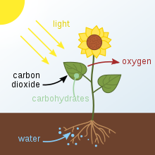

<h3><em><big>The Biochemistry Portal</big></em></h3>

<strong><a title="Biochemistry" href="https://en.wikipedia.org/wiki/Biochemistry">Biochemistry</a></strong>, sometimes called&nbsp;<strong>biological chemistry</strong>, is the study of&nbsp;<a title="Chemical process" href="https://en.wikipedia.org/wiki/Chemical_process">chemical processes</a>&nbsp;within and relating to living&nbsp;<a title="Organism" href="https://en.wikipedia.org/wiki/Organism">organisms</a>. Biochemical processes give rise to the complexity of&nbsp;<a title="Life" href="https://en.wikipedia.org/wiki/Life">life</a>.

A sub-discipline of both&nbsp;<a title="Biology" href="https://en.wikipedia.org/wiki/Biology">biology</a>&nbsp;and&nbsp;<a title="Chemistry" href="https://en.wikipedia.org/wiki/Chemistry">chemistry</a>, biochemistry can be divided into three fields;&nbsp;<a title="Structural biology" href="https://en.wikipedia.org/wiki/Structural_biology">structural biology</a>,&nbsp;<a class="mw-redirect" title="Enzymology" href="https://en.wikipedia.org/wiki/Enzymology">enzymology</a>, and&nbsp;<a title="Metabolism" href="https://en.wikipedia.org/wiki/Metabolism">metabolism</a>. Over the last decades of the 20th century, biochemistry has become successful at explaining living processes through these three disciplines. Almost all&nbsp;<a title="List of life sciences" href="https://en.wikipedia.org/wiki/List_of_life_sciences">areas of the life sciences</a>&nbsp;are being uncovered and developed by biochemical methodology and research. Biochemistry focuses on understanding the chemical basis which allows&nbsp;<a title="Biomolecule" href="https://en.wikipedia.org/wiki/Biomolecule">biological molecules</a>&nbsp;to give rise to the processes that occur within living&nbsp;<a title="Cell (biology)" href="https://en.wikipedia.org/wiki/Cell_(biology)">cells</a>&nbsp;and between cells, which in turn relates greatly to the study and understanding of&nbsp;<a title="Tissue (biology)" href="https://en.wikipedia.org/wiki/Tissue_(biology)">tissues</a>&nbsp;and&nbsp;<a title="Organ (anatomy)" href="https://en.wikipedia.org/wiki/Organ_(anatomy)">organs</a>, as well as organism structure and function.

Biochemistry is closely related to&nbsp;<a title="Molecular biology" href="https://en.wikipedia.org/wiki/Molecular_biology">molecular biology</a>, the study of the&nbsp;<a title="Molecule" href="https://en.wikipedia.org/wiki/Molecule">molecular</a>&nbsp;mechanisms of biological phenomena.

Much of biochemistry deals with the structures, functions, and interactions of biological&nbsp;<a title="Macromolecule" href="https://en.wikipedia.org/wiki/Macromolecule">macromolecules</a>, such as&nbsp;<a title="Protein" href="https://en.wikipedia.org/wiki/Protein">proteins</a>,&nbsp;<a title="Nucleic acid" href="https://en.wikipedia.org/wiki/Nucleic_acid">nucleic acids</a>,&nbsp;<a title="Carbohydrate" href="https://en.wikipedia.org/wiki/Carbohydrate">carbohydrates</a>, and&nbsp;<a title="Lipid" href="https://en.wikipedia.org/wiki/Lipid">lipids</a>, which provide the structure of cells and perform many of the functions associated with life. The chemistry of the cell also depends on the reactions of smaller&nbsp;<a title="Molecule" href="https://en.wikipedia.org/wiki/Molecule">molecules</a>&nbsp;and&nbsp;<a title="Ion" href="https://en.wikipedia.org/wiki/Ion">ions</a>. These can be&nbsp;<a class="mw-redirect" title="Inorganic" href="https://en.wikipedia.org/wiki/Inorganic">inorganic</a>&nbsp;(for example,&nbsp;<a title="Water" href="https://en.wikipedia.org/wiki/Water">water</a>&nbsp;and&nbsp;<a title="Metal" href="https://en.wikipedia.org/wiki/Metal">metal</a>&nbsp;ions) or&nbsp;<a title="Organic compound" href="https://en.wikipedia.org/wiki/Organic_compound">organic</a>&nbsp;(for example, the&nbsp;<a title="Amino acid" href="https://en.wikipedia.org/wiki/Amino_acid">amino acids</a>, which are used to&nbsp;<a title="Protein biosynthesis" href="https://en.wikipedia.org/wiki/Protein_biosynthesis">synthesize proteins</a>). The mechanisms by which&nbsp;<a class="mw-redirect" title="Cell energy" href="https://en.wikipedia.org/wiki/Cell_energy">cells harness energy</a>&nbsp;from their environment via&nbsp;<a title="Chemical reaction" href="https://en.wikipedia.org/wiki/Chemical_reaction">chemical reactions</a>&nbsp;are known as&nbsp;<a title="Metabolism" href="https://en.wikipedia.org/wiki/Metabolism">metabolism</a>. The findings of biochemistry are applied primarily in&nbsp;<a title="Medicine" href="https://en.wikipedia.org/wiki/Medicine">medicine</a>,&nbsp;<a title="Nutrition" href="https://en.wikipedia.org/wiki/Nutrition">nutrition</a>, and&nbsp;<a title="Agriculture" href="https://en.wikipedia.org/wiki/Agriculture">agriculture</a>. In medicine, biochemists investigate the causes and&nbsp;<a class="mw-redirect" title="Pharmaceutical drug" href="https://en.wikipedia.org/wiki/Pharmaceutical_drug">cures</a>&nbsp;of&nbsp;<a title="Disease" href="https://en.wikipedia.org/wiki/Disease">diseases</a>. In nutrition, they study how to maintain health and wellness and study the effects of&nbsp;<a class="mw-redirect" title="Nutritional deficiencies" href="https://en.wikipedia.org/wiki/Nutritional_deficiencies">nutritional deficiencies</a>. In agriculture, biochemists investigate&nbsp;<a title="Soil" href="https://en.wikipedia.org/wiki/Soil">soil</a>&nbsp;and&nbsp;<a title="Fertilizer" href="https://en.wikipedia.org/wiki/Fertilizer">fertilizers</a>. They also try to discover ways to improve crop cultivation, crop storage, and&nbsp;<a title="Pest control" href="https://en.wikipedia.org/wiki/Pest_control">pest control</a>.

<strong><a title="Biochemistry" href="https://en.wikipedia.org/wiki/Biochemistry">Read more...</a></strong>

&nbsp;

&nbsp;

&nbsp;

&nbsp;

Schematic of photosynthesis in plants. The carbohydrates produced are stored in or used by the plant.

&nbsp;

<strong><a title="Photosynthesis" href="https://en.wikipedia.org/wiki/Photosynthesis">Photosynthesis</a></strong>&nbsp;is a process used by plants and other organisms to&nbsp;<a title="Energy transformation" href="https://en.wikipedia.org/wiki/Energy_transformation">convert</a>&nbsp;<a class="mw-redirect" title="Light energy" href="https://en.wikipedia.org/wiki/Light_energy">light energy</a>&nbsp;into&nbsp;<a title="Chemical energy" href="https://en.wikipedia.org/wiki/Chemical_energy">chemical energy</a>&nbsp;that can later be&nbsp;<a title="Cellular respiration" href="https://en.wikipedia.org/wiki/Cellular_respiration">released</a>&nbsp;to fuel the organisms' activities. This chemical energy is stored in&nbsp;<a title="Carbohydrate" href="https://en.wikipedia.org/wiki/Carbohydrate">carbohydrate</a>&nbsp;molecules, such as&nbsp;<a title="Sugar" href="https://en.wikipedia.org/wiki/Sugar">sugars</a>, which are synthesized from&nbsp;<a title="Carbon dioxide" href="https://en.wikipedia.org/wiki/Carbon_dioxide">carbon dioxide</a>&nbsp;and&nbsp;<a title="Water" href="https://en.wikipedia.org/wiki/Water">water</a>&nbsp;&ndash; hence the name&nbsp;<em>photosynthesis</em>, from the&nbsp;<a title="Greek language" href="https://en.wikipedia.org/wiki/Greek_language">Greek</a>&nbsp;<em>phōs</em>&nbsp;(<a class="extiw" title="wikt:&phi;ῶ&sigmaf;" href="https://en.wiktionary.org/wiki/%CF%86%E1%BF%B6%CF%82">&phi;ῶ&sigmaf;</a>), "light", and&nbsp;<em>sunthesis</em>&nbsp;(<a class="extiw" title="wikt:&sigma;ύ&nu;&theta;&epsilon;&sigma;&iota;&sigmaf;" href="https://en.wiktionary.org/wiki/%CF%83%CF%8D%CE%BD%CE%B8%CE%B5%CF%83%CE%B9%CF%82">&sigma;ύ&nu;&theta;&epsilon;&sigma;&iota;&sigmaf;</a>), "putting together". In most cases,&nbsp;<a title="Oxygen" href="https://en.wikipedia.org/wiki/Oxygen">oxygen</a>&nbsp;is also released as a waste product. Most&nbsp;<a title="Plant" href="https://en.wikipedia.org/wiki/Plant">plants</a>, most&nbsp;<a title="Algae" href="https://en.wikipedia.org/wiki/Algae">algae</a>, and&nbsp;<a title="Cyanobacteria" href="https://en.wikipedia.org/wiki/Cyanobacteria">cyanobacteria</a>&nbsp;perform photosynthesis; such organisms are called&nbsp;<a class="mw-redirect" title="Photoautotroph" href="https://en.wikipedia.org/wiki/Photoautotroph">photoautotrophs</a>. Photosynthesis is largely responsible for producing and maintaining the&nbsp;<a class="mw-redirect" title="Atmospheric oxygen" href="https://en.wikipedia.org/wiki/Atmospheric_oxygen">oxygen content</a>&nbsp;of the Earth's atmosphere, and supplies most of the energy necessary for&nbsp;<a title="Life" href="https://en.wikipedia.org/wiki/Life">life on Earth</a>.

Although photosynthesis is performed differently by different species, the process always begins when energy from light is absorbed by&nbsp;<a title="Protein" href="https://en.wikipedia.org/wiki/Protein">proteins</a>&nbsp;called&nbsp;<a title="Photosynthetic reaction centre" href="https://en.wikipedia.org/wiki/Photosynthetic_reaction_centre">reaction centres</a>&nbsp;that contain green&nbsp;<a title="Chlorophyll" href="https://en.wikipedia.org/wiki/Chlorophyll">chlorophyll</a>&nbsp;pigments. In plants, these proteins are held inside&nbsp;<a title="Organelle" href="https://en.wikipedia.org/wiki/Organelle">organelles</a>&nbsp;called&nbsp;<a title="Chloroplast" href="https://en.wikipedia.org/wiki/Chloroplast">chloroplasts</a>, which are most abundant in leaf cells, while in bacteria they are embedded in the&nbsp;<a class="mw-redirect" title="Plasma membrane" href="https://en.wikipedia.org/wiki/Plasma_membrane">plasma membrane</a>. In these light-dependent reactions, some energy is used to strip&nbsp;<a title="Electron" href="https://en.wikipedia.org/wiki/Electron">electrons</a>&nbsp;from suitable substances, such as water, producing oxygen gas. The hydrogen freed by the splitting of water is used in the creation of two further compounds that serve as short-term stores of energy, enabling its transfer to drive other reactions: these compounds are reduced&nbsp;<a title="Nicotinamide adenine dinucleotide phosphate" href="https://en.wikipedia.org/wiki/Nicotinamide_adenine_dinucleotide_phosphate">nicotinamide adenine dinucleotide phosphate</a>&nbsp;(NADPH) and&nbsp;<a title="Adenosine triphosphate" href="https://en.wikipedia.org/wiki/Adenosine_triphosphate">adenosine triphosphate</a>&nbsp;(ATP), the "energy currency" of cells.&nbsp;<strong><a title="Photosynthesis" href="https://en.wikipedia.org/wiki/Photosynthesis">Read more...</a></strong>

&nbsp;

&nbsp;

&nbsp;

<h2><em>Did you know...</em></h2>

<ul>
<li>...that&nbsp;<a title="Human" href="https://en.wikipedia.org/wiki/Human">human</a>&nbsp;metabolism can synthesise 8 to 10 (depending on age) of the 20 standard&nbsp;<a class="mw-redirect" title="Amino acids" href="https://en.wikipedia.org/wiki/Amino_acids">amino acids</a>?</li>
<li>...that the sugar&nbsp;<a title="Ribose" href="https://en.wikipedia.org/wiki/Ribose">ribose</a>&nbsp;is vital for all life as it is used in the synthesis of&nbsp;<a title="DNA" href="https://en.wikipedia.org/wiki/DNA">DNA</a>,&nbsp;<a title="RNA" href="https://en.wikipedia.org/wiki/RNA">RNA</a>&nbsp;and&nbsp;<a title="Adenosine triphosphate" href="https://en.wikipedia.org/wiki/Adenosine_triphosphate">ATP</a>?</li>
<li>...that&nbsp;<a title="Nitrogen" href="https://en.wikipedia.org/wiki/Nitrogen">nitrogen</a>&nbsp;can only be fixed metabolically by a group of&nbsp;<a title="Prokaryote" href="https://en.wikipedia.org/wiki/Prokaryote">prokaryotes</a>&nbsp;known as&nbsp;<a class="mw-redirect" title="Diazotrophs" href="https://en.wikipedia.org/wiki/Diazotrophs">diazotrophs</a>?</li>
<li>...that in humans the balance between&nbsp;<a title="Anabolism" href="https://en.wikipedia.org/wiki/Anabolism">anabolism</a>&nbsp;and&nbsp;<a title="Catabolism" href="https://en.wikipedia.org/wiki/Catabolism">catabolism</a>&nbsp;of&nbsp;<a title="Glucose" href="https://en.wikipedia.org/wiki/Glucose">glucose</a>&nbsp;is largely regulated by&nbsp;<a title="Insulin" href="https://en.wikipedia.org/wiki/Insulin">insulin</a>?</li>
<li>...that&nbsp;<a title="Hydrogen" href="https://en.wikipedia.org/wiki/Hydrogen">hydrogen</a>&nbsp;can be&nbsp;<a class="mw-redirect" title="Biological hydrogen production (Algae)" href="https://en.wikipedia.org/wiki/Biological_hydrogen_production_(Algae)">biologically produced</a>&nbsp;by some&nbsp;<a title="Algae" href="https://en.wikipedia.org/wiki/Algae">algae</a>&nbsp;with the&nbsp;<a title="Enzyme" href="https://en.wikipedia.org/wiki/Enzyme">enzyme</a>&nbsp;<a title="Hydrogenase" href="https://en.wikipedia.org/wiki/Hydrogenase">hydrogenase</a>?</li>
</ul>

&nbsp;

&nbsp;

&nbsp;

<h2><em>Subcategories</em></h2>

<a title="Category:Biochemistry" href="https://en.wikipedia.org/wiki/Category:Biochemistry">Biochemistry</a>

<ul>
<li><a title="Category:Allelopathic substances" href="https://en.wikipedia.org/wiki/Category:Allelopathic_substances">Allelopathic substances</a></li>
<li><a title="Category:Biochemistry awards" href="https://en.wikipedia.org/wiki/Category:Biochemistry_awards">Biochemistry awards</a></li>
<li><a title="Category:Biochemistry methods" href="https://en.wikipedia.org/wiki/Category:Biochemistry_methods">Biochemistry methods</a></li>
<li><a title="Category:Biochemists" href="https://en.wikipedia.org/wiki/Category:Biochemists">Biochemists</a></li>
<li><a title="Category:Bioinorganic chemistry" href="https://en.wikipedia.org/wiki/Category:Bioinorganic_chemistry">Bioinorganic chemistry</a></li>
<li><a title="Category:Biology and pharmacology of chemical elements" href="https://en.wikipedia.org/wiki/Category:Biology_and_pharmacology_of_chemical_elements">Biology and pharmacology of chemical elements</a></li>
<li><a title="Category:Bioluminescence" href="https://en.wikipedia.org/wiki/Category:Bioluminescence">Bioluminescence</a></li>
<li><a title="Category:Biomolecules" href="https://en.wikipedia.org/wiki/Category:Biomolecules">Biomolecules</a></li>
<li><a title="Category:Cellular respiration" href="https://en.wikipedia.org/wiki/Category:Cellular_respiration">Cellular respiration</a></li>
<li><a title="Category:Chemical ecology" href="https://en.wikipedia.org/wiki/Category:Chemical_ecology">Chemical ecology</a></li>
<li><a title="Category:Chemical pathology" href="https://en.wikipedia.org/wiki/Category:Chemical_pathology">Chemical pathology</a></li>
<li><a title="Category:Chemical weapons" href="https://en.wikipedia.org/wiki/Category:Chemical_weapons">Chemical weapons</a></li>
<li><a title="Category:Chirality" href="https://en.wikipedia.org/wiki/Category:Chirality">Chirality</a></li>
<li><a title="Category:Cryobiology" href="https://en.wikipedia.org/wiki/Category:Cryobiology">Cryobiology</a></li>
<li><a title="Category:Biochemistry educators" href="https://en.wikipedia.org/wiki/Category:Biochemistry_educators">Biochemistry educators</a></li>
<li><a title="Category:Fermentation" href="https://en.wikipedia.org/wiki/Category:Fermentation">Fermentation</a></li>
<li><a title="Category:Food chemistry" href="https://en.wikipedia.org/wiki/Category:Food_chemistry">Food chemistry</a></li>
<li><a title="Category:Gene expression" href="https://en.wikipedia.org/wiki/Category:Gene_expression">Gene expression</a></li>
<li><a title="Category:Glycobiology" href="https://en.wikipedia.org/wiki/Category:Glycobiology">Glycobiology</a></li>
<li><a title="Category:Biochemistry literature" href="https://en.wikipedia.org/wiki/Category:Biochemistry_literature">Biochemistry literature</a></li>
<li><a title="Category:Medicinal chemistry" href="https://en.wikipedia.org/wiki/Category:Medicinal_chemistry">Medicinal chemistry</a></li>
<li><a title="Category:Metabolism" href="https://en.wikipedia.org/wiki/Category:Metabolism">Metabolism</a></li>
<li><a title="Category:Molecular biology" href="https://en.wikipedia.org/wiki/Category:Molecular_biology">Molecular biology</a></li>
<li><a title="Category:Neurochemistry" href="https://en.wikipedia.org/wiki/Category:Neurochemistry">Neurochemistry</a></li>
<li><a title="Category:Biochemistry organizations" href="https://en.wikipedia.org/wiki/Category:Biochemistry_organizations">Biochemistry organizations</a></li>
<li><a title="Category:Photosynthesis" href="https://en.wikipedia.org/wiki/Category:Photosynthesis">Photosynthesis</a></li>
<li><a title="Category:Professorships in biochemistry" href="https://en.wikipedia.org/wiki/Category:Professorships_in_biochemistry">Professorships in biochemistry</a></li>
<li><a title="Category:Reagents for biochemistry" href="https://en.wikipedia.org/wiki/Category:Reagents_for_biochemistry">Reagents for biochemistry</a></li>
<li><a title="Category:Signal transduction" href="https://en.wikipedia.org/wiki/Category:Signal_transduction">Signal transduction</a></li>
<li><a title="Category:Biochemistry stubs" href="https://en.wikipedia.org/wiki/Category:Biochemistry_stubs">Biochemistry stubs</a></li>
<li><a title="Category:Biochemistry templates" href="https://en.wikipedia.org/wiki/Category:Biochemistry_templates">Biochemistry templates</a></li>
</ul>

&nbsp;

&nbsp;

<h2><em>Biochemistry topics</em></h2>

<table cellspacing="0px;">
<tbody>
<tr>
<td><strong>Fundamental Concepts</strong></td>
<td><strong>Metabolic Processes</strong></td>
<td><strong>Metabolic Pathways</strong></td>
<td><strong>Major Biochemicals and Enzymes</strong></td>
<td><strong>Other</strong></td>
</tr>
<tr>
<td>
<ul>
<li>&nbsp;<a title="Metabolism" href="https://en.wikipedia.org/wiki/Metabolism">Metabolism</a></li>
</ul>
<dl>
<dd>
<ul>
<li><a title="Anabolism" href="https://en.wikipedia.org/wiki/Anabolism">Anabolism</a></li>
<li><a title="Catabolism" href="https://en.wikipedia.org/wiki/Catabolism">Catabolism</a></li>
</ul>
</dd>
</dl>
<ul>
<li><a title="Metabolic pathway" href="https://en.wikipedia.org/wiki/Metabolic_pathway">Metabolic pathway</a></li>
<li><a title="Enzyme" href="https://en.wikipedia.org/wiki/Enzyme">Enzyme</a></li>
</ul>
</td>
<td>
<ul>
<li><a title="Carbohydrate metabolism" href="https://en.wikipedia.org/wiki/Carbohydrate_metabolism">Carbohydrate metabolism</a></li>
<li><a title="Lipid metabolism" href="https://en.wikipedia.org/wiki/Lipid_metabolism">Lipid metabolism</a></li>
<li><a title="Amino acid synthesis" href="https://en.wikipedia.org/wiki/Amino_acid_synthesis">Amino acid synthesis</a></li>
<li><a class="mw-redirect" title="Nucleotide synthesis" href="https://en.wikipedia.org/wiki/Nucleotide_synthesis">Nucleotide synthesis</a></li>
<li><a title="Photosynthesis" href="https://en.wikipedia.org/wiki/Photosynthesis">Photosynthesis</a></li>
<li><a title="Respiration (physiology)" href="https://en.wikipedia.org/wiki/Respiration_(physiology)">Respiration</a></li>
</ul>
<dl>
<dd>
<ul>
<li><a class="mw-redirect" title="Aerobic respiration" href="https://en.wikipedia.org/wiki/Aerobic_respiration">Aerobic</a></li>
<li><a title="Anaerobic respiration" href="https://en.wikipedia.org/wiki/Anaerobic_respiration">Anaerobic</a></li>
</ul>
</dd>
</dl>
</td>
<td>
<ul>
<li><a title="Glycolysis" href="https://en.wikipedia.org/wiki/Glycolysis">Glycolysis</a></li>
<li><a title="Gluconeogenesis" href="https://en.wikipedia.org/wiki/Gluconeogenesis">Gluconeogenesis</a></li>
<li><a class="mw-redirect" title="Citric Acid Cycle" href="https://en.wikipedia.org/wiki/Citric_Acid_Cycle">Citric Acid Cycle</a></li>
<li><a title="Pentose phosphate pathway" href="https://en.wikipedia.org/wiki/Pentose_phosphate_pathway">Pentose phosphate pathway</a></li>
<li><a class="mw-redirect" title="Urea Cycle" href="https://en.wikipedia.org/wiki/Urea_Cycle">Urea Cycle</a></li>
<li><a class="mw-redirect" title="Pyrimidine synthesis" href="https://en.wikipedia.org/wiki/Pyrimidine_synthesis">Pyrimidine synthesis</a></li>
<li><a class="mw-disambig" title="Purine synthesis" href="https://en.wikipedia.org/wiki/Purine_synthesis">Purine synthesis</a></li>
</ul>
</td>
<td>
<ul>
<li><a title="Glucose" href="https://en.wikipedia.org/wiki/Glucose">Glucose</a></li>
<li><a title="Fructose" href="https://en.wikipedia.org/wiki/Fructose">Fructose</a></li>
<li><a title="Glycogen" href="https://en.wikipedia.org/wiki/Glycogen">Glycogen</a></li>
<li><a title="Starch" href="https://en.wikipedia.org/wiki/Starch">Starch</a></li>
<li><a class="mw-redirect" title="Pyruvate" href="https://en.wikipedia.org/wiki/Pyruvate">Pyruvate</a></li>
<li><a title="Ribose" href="https://en.wikipedia.org/wiki/Ribose">Ribose</a></li>
<li><a title="Urea" href="https://en.wikipedia.org/wiki/Urea">Urea</a></li>
<li><a title="Adenosine triphosphate" href="https://en.wikipedia.org/wiki/Adenosine_triphosphate">ATP</a></li>
<li><a class="mw-disambig" title="NAD" href="https://en.wikipedia.org/wiki/NAD">NAD</a></li>
<li><a title="Coenzyme A" href="https://en.wikipedia.org/wiki/Coenzyme_A">Coenzyme A</a></li>
</ul>
</td>
<td>

<strong>Techniques</strong>

<ul>
<li><a title="Metabolic network modelling" href="https://en.wikipedia.org/wiki/Metabolic_network_modelling">Metabolic network modelling</a></li>
</ul>

<strong>Biochemists</strong>

<ul>
<li><a title="Louis Pasteur" href="https://en.wikipedia.org/wiki/Louis_Pasteur">Louis Pasteur</a></li>
<li><a title="Eduard Buchner" href="https://en.wikipedia.org/wiki/Eduard_Buchner">Eduard Buchner</a></li>
<li><a title="Arthur Harden" href="https://en.wikipedia.org/wiki/Arthur_Harden">Arthur Harden</a></li>
<li><a title="William John Young" href="https://en.wikipedia.org/wiki/William_John_Young">William Young</a></li>
<li><a title="Otto Fritz Meyerhof" href="https://en.wikipedia.org/wiki/Otto_Fritz_Meyerhof">Otto Fritz Meyerhof</a></li>
<li><a title="Luis Federico Leloir" href="https://en.wikipedia.org/wiki/Luis_Federico_Leloir">Luis Federico Leloir</a></li>
</ul>
</td>
</tr>
</tbody>
</table>

