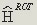
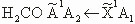

<ul>
<li class="title"><a href="#course1">Principles of Inorganic Chemistry II</a></li>
 <li class="title"><a href="#course2">Principles of Inorganic Chemistry III</a></li> 
  <li class="title"><a href="#course3">Crystal Structure Refinement </a></li> 
  <li class="title"><a href="#course4">Crystal Structure Analysis </a></li>
   <li class="title"><a href="#course5">Physical Chemistry </a></li>
  <li class="title"><a href="#course6">Physical Chemistry II </a></li>
   <li class="title"><a href="#course7">Computational Quantum Mechanics of Molecular and Extended Systems </a></li>
    <li class="title"><a href="#course8">Kinetics of Chemical Reactions </a></li>
 <li class="title"><a href="#course9">Non-Equilibrium Statistical Mechanics </a></li>
  <li class="title"><a href="#course10">Introductory Quantum Mechanics I </a></li>
  <li class="title"><a href="#course11">Introductory Quantum Mechanics II </a></li>
   <li class="title"><a href="#course12">Small-Molecule Spectroscopy and Dynamics </a></li>
  <li class="title"><a href="#course13">Chemistry of Biomolecules I </a></li>
   <li class="title"><a href="#course14">Synthetic Organic Chemistry II</a></li>
</ul>
 

<h2 id ="course1">Principles of Inorganic Chemistry II </h2>
<table class="tablewidth50" summary="See table caption for summary.">
<tbody>
<tr class="row">
<td>Symmetry elements and operations (<a href="Lecture_1.pdf" data-smd-id="s103">PDF</a>)</td>
</tr>
<tr class="alt-row">
<td>Operator properties and mathematical groups (<a href="Lecture_2.pdf" data-smd-id="s104">PDF</a>)</td>
</tr>
<tr class="row">
<td>Irreducible representations and character tables (<a href="Lecture_3.pdf" data-smd-id="s105">PDF</a>)</td>
</tr>
<tr class="alt-row">
<td>Molecular point groups I (<a href="Lecture_4.pdf" data-smd-id="s106">PDF</a>)</td>
</tr>
<tr class="row">
<td>Molecular point groups II (<a href="Lecture_5.pdf" data-smd-id="s107">PDF</a>)</td>
</tr>
<tr class="alt-row">
<td>LCAO and H&uuml;ckel theory I (<a href="Lecture_6.pdf" data-smd-id="s108">PDF</a>)</td>
</tr>
<tr class="row">
<td>H&uuml;ckel theory II (<a href="Lecture_7.pdf" data-smd-id="s109">PDF</a>)</td>
</tr>
<tr class="alt-row">
<td>N-dimensional cyclic systems (<a href="Lecture_8.pdf" data-smd-id="s110">PDF</a>)</td>
</tr>
<tr class="row">
<td>Band theory in solids (<a href="Lecture_9.pdf" data-smd-id="s111">PDF</a>)</td>
</tr>
<tr class="alt-row">
<td>

General electronic considerations of metal-ligand complexes&nbsp;(<a href="Lecture_10.pdf" data-smd-id="s112">PDF</a>)

</td>
</tr>
<tr class="row">
<td>Frontier molecular orbitals of &sigma;-donor,&nbsp;&pi;-donor and &pi;-acceptor ligands (<a href="Lecture_11.pdf" data-smd-id="s113">PDF</a>)</td>
</tr>
<tr class="alt-row">
<td>Octahedral ML6&nbsp;&sigma; complexes (<a href="Lecture_12.pdf" data-smd-id="s114">PDF</a>)</td>
</tr>
<tr class="row">
<td>Octahedral ML6&nbsp;&pi; complexes (<a href="Lecture_13.pdf" data-smd-id="s115">PDF</a>)</td>
</tr>
<tr class="alt-row">
<td>Angular overlap method and M-L diatomics (<a href="Lecture_14.pdf" data-smd-id="s116">PDF</a>)</td>
</tr>
</tbody>
</table>
 
<h2 id ="course2">Principles of Inorganic Chemistry III </h2>

<table class="tablewidth50" summary="See table caption for summary.">
<tbody>
<tr class="alt-row">
<td headers="col2">Aluminum Chemistry I (<a href="1/lecture_2.pdf" data-smd-id="s105">PDF</a>)</td>
</tr>
<tr class="row">
<td headers="col2">Aluminum II (<a href="1/lecture_3.pdf" data-smd-id="s106">PDF</a>)</td>
</tr>
<tr class="alt-row">
<td headers="col2">Phosphorus (<a href="1/lecture_4.pdf" data-smd-id="s107">PDF</a>)</td>
</tr>
<tr class="row">
<td headers="col2">Gallium and Indium (<a href="1/lecture_5.pdf" data-smd-id="s108">PDF</a>)</td>
</tr>
<tr class="alt-row">
<td headers="col2">Gallium Multiple Bonds (<a href="1/lecture_6.pdf" data-smd-id="s109">PDF</a>)</td>
</tr>
<tr class="row">
<td headers="col2">Gallium, Phosphorus, and&nbsp;Tin (<a href="1/lecture_7.pdf" data-smd-id="s110">PDF</a>)</td>
</tr>
<tr class="alt-row">
<td headers="col2">Nitrogen, Halogens, Noble Gases (<a href="1/lecture_9.pdf" data-smd-id="s111">PDF</a>)</td>
</tr>
<tr class="row">
<td headers="col2">Fluorine, Krypton (<a href="1/lecture_10.pdf" data-smd-id="s112">PDF</a>)</td>
</tr>
<tr class="alt-row">
<td headers="col2">Relativistic Effects (<a href="1/lecture_11.pdf" data-smd-id="s113">PDF</a>)</td>
</tr>
</tbody>
</table>

 

<h2 id ="course3">Crystal Structure Refinement </h2>

<table class="tablewidth50" summary="See table caption for summary.">
<tbody>
<tr class="row">
<td>From crystal to diffraction pattern (<a href="MIT5_067F09_lec1_data.pdf" data-smd-id="s103">PDF</a>)</td>
</tr>
<tr class="alt-row">
<td>The SHELX package (<a href="MIT5_067F09_lec2_shelx.pdf" data-smd-id="s104">PDF</a>)</td>
</tr>
<tr class="row">
<td>Hydrogen atoms (<a href="MIT5_067F09_lec3.pdf" data-smd-id="s105">PDF</a>)</td>
</tr>
<tr class="alt-row">
<td>Disorder (<a href="MIT5_067F09_lec4.pdf" data-smd-id="s106">PDF</a>)</td>
</tr>
<tr class="row">
<td>Twinning (<a href="MIT5_067F09_lec5_twinning.pdf" data-smd-id="s107">PDF - 1.2MB</a>)</td>
</tr>
<tr class="alt-row">
<td>Artefacts (<a href="MIT5_067F09_lec6_artefact.pdf" data-smd-id="s108">PDF</a>)</td>
</tr>
</tbody>
</table>

 

<h2 id ="course4">Crystal Structure Analysis </h2>

<table summary="See table caption for summary.">
<tbody>
<tr class="row">
<td>
<h3 class="subsubhead">Introduction (<a href="intro_handout.pdf">PDF</a>)</h3>

Overview, textbooks, history of crystallography

</td>
</tr>
<tr class="alt-row">
<td>
<h3 class="subsubhead">Symmetry in 2D (<a href="symm_handout1_re.pdf">PDF</a>)</h3>

Definition of symmetry, introduction of symmetry operators

Compatibility of symmetry operators with translation

Combining symmetry operations and determination of plane groups

</td>
</tr>
<tr class="row">
<td>
<h3 class="subsubhead">Symmetry in 3D (<a href="symm_handout2.pdf">PDF</a>)</h3>

Extension of the plane groups concept to the third dimension: space groups

Introduction of screw axes and glide planes

Point groups vs. space groups

The unit cell and crystallographic conventions

</td>
</tr>
<tr class="alt-row">
<td>
<h3 class="subsubhead">X-rays and matter (<a href="diffrac_handout1.pdf">PDF</a>)</h3>

X-ray generation

Diffraction experiment with optical grids and laser pointers

Convolution theorem and Fourier transformation

Introduction of Bragg's law and Miller indices

</td>
</tr>
<tr class="row">
<td>
<h3 class="subsubhead">Geometry of diffraction (<a href="diffrac_handout2.pdf">PDF</a>)</h3>

Reciprocal space vs. real space

Ewald construction as a geometric interpretation of Bragg's law

</td>
</tr>
<tr class="alt-row">
<td>
<h3 class="subsubhead">Structure factors</h3>

Real atoms are no point atoms (atomic form factors) and show thermal motion (atomic displacement factors)

Having more than one atom per unit cell leads to structure factors

Fourier transformation gives rise to electron density; crystallographic resolution

</td>
</tr>
<tr class="row">
<td>
<h3 class="subsubhead">Structure factors II (<a href="phasing_handout1.pdf">PDF - 1.7MB</a>)</h3>

Complex numbers, Euler's equation and the argand plane

Introduction of the phase problem

</td>
</tr>
<tr class="alt-row">
<td>
<h3 class="subsubhead">Symmetry in reciprocal space (<a href="phasing_handout2.pdf">PDF</a>)</h3>

Introduction of Friedel's law and laue groups

Space group determination: |<em>E</em>2-1| statistics, systematic absences, crystallographic directions for triclinic, monoclinic, orthorhombic and tetragonal systems

Introduction of the Patterson function and Harker sections, as well as direct methods for structure solution

</td>
</tr>
<tr class="row">
<td>
<h3 class="subsubhead">Structure refinement (<a href="refine_hand1_rev.pdf">PDF</a>)</h3>

Different types of electron density maps (<em>Fo</em>,&nbsp;<em>Fc</em>,&nbsp;<em>Fo</em>-<em>Fc</em>, etc.)

Introduction of anisotropic displacement parameters

Minimization functions: the least-squares approach and different R-factors

Crystallographic parameters, constraints and restraints

</td>
</tr>
<tr class="row">
<td>
<h3 class="subsubhead">Anomalous scattering (<a href="anomal_hand1_rev.pdf">PDF</a>)</h3>

Absorption of X-ray photons leads to loss of symmetry in orbital geometry, which results in a violation of Fridel's law

</td>
</tr>
</tbody>
</table>
 

<h2 id ="course5">Physical Chemistry </h2>

<table class="tablewidth75">
<tbody>
<tr class="row">
<td><a href="MIT5_61F17_lec1.pdf" data-smd-id="s107">Quantum Mechanics&mdash;Historical Background, Photoelectric Effect, Compton Scattering (PDF)</a></td>
</tr>
<tr class="alt-row">
<td>

<a href="MIT5_61F17_lec2.pdf" data-smd-id="s109">Wave Nature of the Electron and the Internal Structure of an Atom (PDF)</a>

<a href="MIT5_61F17_lec2_supp.pdf" data-smd-id="s110">Lecture 2 Supplement:&nbsp;Geiger&ndash;Marsden Revisited (PDF)</a>

</td>
</tr>
<tr class="row">
<td><a href="MIT5_61F17_lec3.pdf" data-smd-id="s112">Two-Slit Experiment, Quantum Weirdness (PDF)</a></td>
</tr>
<tr class="alt-row">
<td><a href="MIT5_61F17_lec4.pdf" data-smd-id="s114">The Classical Wave Equation and Separation of Variables (PDF)</a></td>
</tr>
<tr class="row">
<td><a href="MIT5_61F17_lec5.pdf" data-smd-id="s116">Begin Quantum Mechanics: Free Particle and Particle in a 1D Box (PDF)</a></td>
</tr>
<tr class="alt-row">
<td><a href="MIT5_61F17_lec6.pdf" data-smd-id="s118">3-D Box and Separation of Variables (PDF)</a></td>
</tr>
<tr class="row">
<td><a href="MIT5_61F17_lec7.pdf" data-smd-id="s120">Classical Mechanical Harmonic Oscillator (PDF)</a></td>
</tr>
<tr class="alt-row">
<td><a href="MIT5_61F17_lec8.pdf" data-smd-id="s122">Quantum Mechanical Harmonic Oscillator (PDF)</a></td>
</tr>
<tr class="row">
<td><a href="MIT5_61F17_lec9.pdf" data-smd-id="s124">Harmonic Oscillator: Creation and Annihilation Operators (PDF)</a></td>
</tr>
<tr class="alt-row">
<td><a href="MIT5_61F17_lec10.pdf" data-smd-id="s126">The Time-Dependent Schr&ouml;dinger Equation&nbsp;(PDF)</a></td>
</tr>
<tr class="row">
<td>

<a href="MIT5_61F17_lec11.pdf" data-smd-id="s127">Wavepacket Dynamics for Harmonic Oscillator and PIB (PDF)</a>

<a href="MIT5_61F17_lec11_supp.pdf" data-smd-id="s129">Lecture 11 Supplement:&nbsp;Nonstationary States of Quantum Mechanical Harmonic Oscillator (PDF)</a>

</td>
</tr>
<tr class="alt-row">
<td><a href="MIT5_61F17_lec12.pdf" data-smd-id="s131">Looking Backward Before First Hour Exam: Postulate&nbsp;(PDF)</a></td>
</tr>
<tr class="row">
<td><a href="MIT5_61F17_lec13_lec14.pdf" data-smd-id="s132">From Hij&nbsp;Integrals to H Matrices (PDF)</a></td>
</tr>
<tr class="alt-row">
<td><a href="MIT5_61F17_lec15.pdf" data-smd-id="s134">Non-Degenerate Perturbation Theory I&nbsp;(PDF)</a></td>
</tr>
<tr class="row">
<td>

<a href="MIT5_61F17_lec16.pdf" data-smd-id="s136">Non-Degenerate Perturbation Theory II: Harmonic Oscillators Using a,a&dagger;&nbsp;(PDF)</a>

<a href="MIT5_61F17_lec16_supp.pdf" data-smd-id="s138">Lecture 16 Supplement:&nbsp;Non-Degenerate Perturbation Theory III (PDF)</a>

</td>
</tr>
<tr class="alt-row">
<td><a href="MIT5_61F17_lec17.pdf" data-smd-id="s140">Rigid Rotor I (PDF)</a></td>
</tr>
<tr class="row">
<td><a href="MIT5_61F17_lec18.pdf" data-smd-id="s142">Rigid Rotor II (PDF)&nbsp;</a></td>
</tr>
<tr class="alt-row">
<td>

<a href="MIT5_61F17_lec19.pdf" data-smd-id="s144">Spectroscopy: Probing Molecules with Light (PDF)</a>&nbsp;

<a href="MIT5_61F17_lec19_supp.pdf" data-smd-id="s146">Lecture 19 Supplement:&nbsp;Perturbation Theory: Matrix Notation, Applications to Dynamics (PDF)</a>

</td>
</tr>
<tr class="row">
<td><a href="MIT5_61F17_lec20.pdf" data-smd-id="s148">Hydrogen Atom I (PDF)&nbsp;</a></td>
</tr>
<tr class="alt-row">
<td><a href="MIT5_61F17_lec21.pdf" data-smd-id="s150">Hydrogen Atom II (PDF)</a></td>
</tr>
<tr class="row">
<td><a href="MIT5_61F17_lec22.pdf" data-smd-id="s151">Helium Atom (PDF)</a></td>
</tr>
<tr class="alt-row">
<td>

<a href="MIT5_61F17_lec23.pdf" data-smd-id="s152">Many&ndash;Electron Atoms&nbsp;(PDF)</a>

<a href="MIT5_61F17_lec23_supp.pdf" data-smd-id="s153">Lecture 23 Supplement:&nbsp;Slater Determinantal Matrix Elements (PDF)</a>

</td>
</tr>
<tr class="row">
<td>

<a href="MIT5_61F17_lec24.pdf" data-smd-id="s155">Molecular Orbital Theory, Matrix Mechanics and Variational Principle&nbsp;(PDF)</a>&nbsp;

<a href="MIT5_61F17_lec24_supp.pdf" data-smd-id="s157">Lecture 24 Supplement:&nbsp;General Eigenvalue Problem for LCAO-MO Expressed in Matrix Notation (PDF)</a>

</td>
</tr>
<tr class="alt-row">
<td><a href="MIT5_61F17_lec25.pdf" data-smd-id="s159">Molecular Orbital Theory of Diatomic Molecules&nbsp;(PDF)</a></td>
</tr>
<tr class="row">
<td><a href="MIT5_61F17_lec26.pdf" data-smd-id="s161">Qualitative MolecularOrbital Theory: H&uuml;ckel Theory (PDF)</a>&nbsp;</td>
</tr>
<tr class="alt-row">
<td><a href="MIT5_61F17_lec27.pdf" data-smd-id="s163">Non-Degenerate Perturbation Theory III&nbsp;(PDF)</a></td>
</tr>
<tr class="row">
<td>

<a href="MIT5_61F17_lec28.pdf" data-smd-id="s165">Modern Electronic Structure Theory: Basis Sets&nbsp;(PDF)&nbsp;</a>

<a href="MIT5_61F17_lec28_29_notes.pdf" data-smd-id="s167">Modern Electronic Structure (PDF)</a>

<a href="MIT5_61F17_lec29.pdf" data-smd-id="s169">Modern Electronic Structure Theory: Electron Correlation (PDF)</a>

</td>
</tr>
<tr class="alt-row">
<td><a href="MIT5_61F17_lec30_lec31.pdf" data-smd-id="s170">Electronic Spectroscopy. Franck-Condon (PDF)</a></td>
</tr>
<tr class="row">
<td>

<a href="MIT5_61F17_lec32.pdf" data-smd-id="s172">Adiabatic&harr;Diabatic: Zewail&nbsp;(PDF)</a>

<a href="MIT5_61F17_lec32_supp.pdf" data-smd-id="s173">Lecture 32 Supplement:&nbsp;Zewail Wavepacket Experiment (PDF - 1MB)</a>

</td>
</tr>
<tr class="alt-row">
<td><a href="MIT5_61F17_lec33.pdf" data-smd-id="s174">Intermolecular Interactions&nbsp;(PDF)</a></td>
</tr>
<tr class="row">
<td><a href="MIT5_61F17_lec34.pdf" data-smd-id="s176">Electronic Spectroscopy and Photochemistry (PDF - 1MB)</a></td>
</tr>
<tr class="alt-row">
<td><a href="MIT5_61F17_lec35.pdf" data-smd-id="s177">Delta-functions, Eigenfunctions of X, and Discrete Variable Representation&nbsp;(PDF)</a></td>
</tr>
<tr class="row">
<td><a href="MIT5_61F17_lec36.pdf" data-smd-id="s179">Time Dependence of Two-Level Systems: Density Matrix, Rotating Wave Approximation&nbsp;(PDF)</a></td>
</tr>
</tbody>
</table>

&nbsp;

<h2 id ="course6">Physical Chemistry II </h2>

<table class="tablewidth75" summary="See table caption for summary.">
<tbody>
<tr class="row">
<td>Review of thermodynamics</td>
<td>(<a href="01_562ln08.pdf" data-smd-id="s104">PDF</a>)</td>
</tr>
<tr class="alt-row">
<td>E, A, and S: macroscopic properties for microscopic probabilities {Pi}</td>
<td>(<a href="02_562ln08.pdf" data-smd-id="s105">PDF</a>)</td>
</tr>
<tr class="row">
<td>Canonical partition function: replace {Pi} by Q</td>
<td>(<a href="03_562ln08.pdf" data-smd-id="s106">PDF</a>)</td>
</tr>
<tr class="alt-row">
<td>Microcanonical ensemble: replace {Pi} by &Omega;, Q vs. &Omega;</td>
<td>(<a href="04_562ln08.pdf" data-smd-id="s107">PDF</a>)</td>
</tr>
<tr class="row">
<td>Molecular partition function: replace E (assembly) by &epsilon; (molecule)</td>
<td>(<a href="05_562ln08.pdf" data-smd-id="s108">PDF</a>)</td>
</tr>
<tr class="alt-row">
<td>Q corrected for molecular indistinguishability</td>
<td>(<a href="06_562ln08.pdf" data-smd-id="s109">PDF</a>)</td>
</tr>
<tr class="row">
<td>Translational part of Boltzmann partition function</td>
<td>(<a href="07_562ln08.pdf" data-smd-id="s110">PDF</a>)</td>
</tr>
<tr class="alt-row">
<td>Boltzmann, Fermi-Dirac, and Bose-Einstein statistics</td>
<td>(<a href="08_562ln08.pdf" data-smd-id="s111">PDF - 1.1 MB</a>)</td>
</tr>
<tr class="row">
<td>Calculation of macroscopic properties from microscopic energy levels: qtrans</td>
<td>(<a href="09_562ln08.pdf" data-smd-id="s112">PDF</a>)</td>
</tr>
<tr class="alt-row">
<td>

Quantum vs. classical qtrans

Equipartition

Internal degrees of freedom

</td>
<td>(<a href="10_562ln08.pdf" data-smd-id="s113">PDF</a>)</td>
</tr>
<tr class="row">
<td>Internal degrees of freedom for atoms and diatomic molecules</td>
<td>(<a href="11_562ln08.pdf" data-smd-id="s114">PDF</a>)</td>
</tr>
<tr class="alt-row">
<td>

Rotational partition function

Equipartition

</td>
<td>(<a href="12_562ln08.pdf" data-smd-id="s115">PDF</a>)</td>
</tr>
<tr class="row">
<td>Nuclear spin statistics: symmetry number, &sigma; Low temperature limit for rotational partition function</td>
<td>

(<a href="13_562ln08.pdf" data-smd-id="s116">PDF</a>)

Supplement (<a href="13s_562ln08.pdf" data-smd-id="s117">PDF</a>)

</td>
</tr>
<tr class="alt-row">
<td>Low and high-T limits for qrot&nbsp;and qvib</td>
<td>(<a href="14_562ln08.pdf" data-smd-id="s118">PDF</a>)</td>
</tr>
<tr class="row">
<td>Polyatomic molecules: rotation and vibration</td>
<td>(<a href="15_562ln08.pdf" data-smd-id="s119">PDF</a>)</td>
</tr>
<tr class="alt-row">
<td>Chemical equilibrium I</td>
<td>(<a href="16_562ln08.pdf" data-smd-id="s120">PDF</a>)</td>
</tr>
<tr class="row">
<td>Chemical equilibrium II</td>
<td>(<a href="17_562ln08.pdf" data-smd-id="s121">PDF</a>)</td>
</tr>
<tr class="alt-row">
<td>Model intermolecular potentials</td>
<td>(<a href="18_562ln08.pdf" data-smd-id="s122">PDF</a>)</td>
</tr>
<tr class="row">
<td>Configurational integral: cluster expansion</td>
<td>(<a href="19_562ln08.pdf" data-smd-id="s123">PDF</a>)</td>
</tr>
<tr class="alt-row">
<td>Virial equation of state</td>
<td>(<a href="20_562ln08.pdf" data-smd-id="s124">PDF</a>)</td>
</tr>
<tr class="row">
<td>Thermodynamics of solid: Einstein and Debye models</td>
<td>

(<a href="21_562ln08.pdf" data-smd-id="s125">PDF</a>)

Supplement (<a href="21s_562ln08.pdf" data-smd-id="s126">PDF</a>)

</td>
</tr>
<tr class="alt-row">
<td>Einstein and Debye solids</td>
<td>(<a href="22_562ln08.pdf" data-smd-id="s127">PDF - 1.4 MB</a>)</td>
</tr>
<tr class="row">
<td>Phonons: 1-D linear chain of atoms</td>
<td>(<a href="23_562ln08.pdf" data-smd-id="s128">PDF</a>)</td>
</tr>
<tr class="alt-row">
<td>Free electron theory of a metal</td>
<td>(<a href="24_562ln08.pdf" data-smd-id="s129">PDF</a>)</td>
</tr>
<tr class="row">
<td>Heat capacity in metals</td>
<td>&nbsp;</td>
</tr>
<tr class="alt-row">
<td>Band theory of solids</td>
<td>(<a href="26_562ln08.pdf" data-smd-id="s130">PDF</a>)</td>
</tr>
<tr class="row">
<td>Crystal phase equilibria</td>
<td>&nbsp;</td>
</tr>
<tr class="alt-row">
<td>Kinetic theory of gases: Maxwell-Boltzmann distribution</td>
<td>(<a href="28_562ln08.pdf" data-smd-id="s131">PDF</a>)</td>
</tr>
<tr class="row">
<td>Kinetic theory of gases: effusion and collisions</td>
<td>(<a href="29_562ln08.pdf" data-smd-id="s132">PDF - 1.0 MB</a>)</td>
</tr>
<tr class="alt-row">
<td>Kinetic theory of gases: collision dynamics and scattering</td>
<td>(<a href="30_562ln08.pdf" data-smd-id="s133">PDF</a>)</td>
</tr>
<tr class="row">
<td>Kinetic theory of gases: mean free path and transport</td>
<td>(<a href="31_562ln08.pdf" data-smd-id="s134">PDF</a>)</td>
</tr>
<tr class="alt-row">
<td>Kinetic theory of gases: transport coefficients</td>
<td>(<a href="32_562ln08.pdf" data-smd-id="s135">PDF</a>)</td>
</tr>
<tr class="row">
<td>Transition state theory I</td>
<td>(<a href="33_562ln08.pdf" data-smd-id="s136">PDF</a>)</td>
</tr>
<tr class="alt-row">
<td>

Transition state theory II

Kinetic isotope effect

</td>
<td>(<a href="34_562ln08.pdf" data-smd-id="s137">PDF</a>)</td>
</tr>
<tr class="alt-row">
<td>Rates of unimolecular reactions: RRKM</td>
<td>(<a href="36_562ln08.pdf" data-smd-id="s138">PDF</a>)</td>
</tr>
</tbody>
</table>
 
<h2 id ="course7">Computational Quantum Mechanics of Molecular and Extended Systems  </h2>

<table class="tablewidth50" summary="See table 
caption for summary.">
<tbody>
<tr class="row">
<td headers="col2">Introduction, Textbook and Notes, Many Body Schr&ouml;dinger Equation, Density Functional Theory, Examples and Inspiration (<a href="Lec1.pdf">PDF</a>)</td>
</tr>
<tr class="alt-row">
<td headers="col2">Electronic Spin, Spin Orbitals, Molecular Orbital Theory, Valence Bond Theory (<a href="Lec2.pdf">PDF</a>)</td>
</tr>
<tr class="row">
<td headers="col2">Hartree-Fock Theory, Matrix Manipulations (<a href="Lec3.pdf">PDF</a>)</td>
</tr>
<tr class="alt-row">
<td headers="col2">Mathematical Underpinnings, Dirac Notation, G03 Calculations (<a href="Lec4.pdf">PDF</a>)</td>
</tr>
<tr class="alt-row">
<td headers="col2">Solution of Hartree-Fock Equations, Variational Principle, Mean Field Theory (<a href="Lec6.pdf">PDF</a>)</td>
</tr>
<tr class="row">
<td headers="col2">Solution of H-F Equations (cont.), Meaning of Eigenvalues, Basis Sets Introduction (<a href="Lec7.pdf">PDF</a>)</td>
</tr>
<tr class="alt-row">
<td headers="col2">Gaussian Basis Sets (<a href="Lec8.pdf">PDF</a>)</td>
</tr>
<tr class="row">
<td headers="col2">Correlation, CI, MP Perturbation Theories (<a href="Lec9.pdf">PDF</a>)</td>
</tr>
<tr class="alt-row">
<td headers="col2">Density Functional Theory (DFT) - Introduction (<a href="Lec10.pdf">PDF</a>)</td>
</tr>
<tr class="row">
<td headers="col2">DFT: Solution of Kohn-Sham Equations and Exchange-Correlation Functionals (<a href="Lec11.pdf">PDF</a>)</td>
</tr>
<tr class="alt-row">
<td headers="col2">Coupled-Cluster Theories, QCISD, G1, G2 (<a href="Lec12.pdf">PDF</a>)</td>
</tr>
<tr class="row">
<td headers="col2">G1, G2 (cont.), Comparison, NCSA Teams, Projects (<a href="Lec13.pdf">PDF</a>)</td>
</tr>
<tr class="alt-row">
<td headers="col2">The Plane-wave Pseudopotential Method (PWPP) (<a href="Lec14.pdf">PDF</a>)</td>
</tr>
<tr class="alt-row">
<td headers="col2">Car-Parrinello Molecular Dynamics - Method (<a href="Lec16.pdf">PDF</a>)</td>
</tr>
<tr class="row">
<td headers="col2">Running the Car-Parrinello Code (<a href="Lec17.pdf">PDF</a>)</td>
</tr>
<tr class="alt-row">
<td headers="col2">Car-Parrinello Molecular Dynamics - Applications (<a href="Lec18.pdf">PDF</a>)</td>
</tr>
<tr class="row">
<td headers="col2">Embedding, Reaction Field Methods, Solvation, Combined QM/MM (<a href="Lec19.pdf">PDF</a>)</td>
</tr>
<tr class="alt-row">
<td headers="col2">Exploring Complex Free Energy Landscapes - Reactivity (<a href="Lec20.pdf">PDF</a>)</td>
</tr>
<tr class="row">
<td headers="col2">Computing Reaction Rate Constants (<a href="Lec21.pdf">PDF</a>)</td>
</tr>
<tr class="alt-row">
<td headers="col2">Design of Selective, Sulfur Resistant, Oxidation Automotive Catalysts (Presented by Course Teaching Assistant) (<a href="lec24.pdf">PDF</a>)</td>
</tr>
</tbody>
</table>

 

<h2 id ="course8">Kinetics of Chemical Reactions </h2>

<table class="tablewidth50" summary="Course Table Listing">
<tbody>
<tr class="row">
<td headers="col2"><em>Elementary Kinetics </em> Introduction  Elementary Steps, Steady State Approximation, Transform Methods  Numerical Solution of Differential Equations  Use of CHEMKIN&reg;&nbsp;and Similar Software  Equilibrium  Literature Sources of Thermo, Kinetics</td>
<td headers="col3">Numerical Solution to Kinetic Equations (<a href="num_kin_eq1.pdf" data-smd-id="s106">PDF 1</a>) (<a href="num_kin_mod2.pdf" data-smd-id="s107">PDF 2</a>)</td>
</tr>
<tr class="row">
<td headers="col2"><em>Reaction Rate Theory </em> Potential Energy Surfaces  Intro to Quantum Chemistry  Reaction Paths  Transition State Theory  RRKM Theory  Relation to Quantum Scattering  Pressure Dependence: Fall-off, Chemical-activation</td>
<td headers="col3">A Short Summary of Quantum Chemistry (<a href="qchemsummary.pdf" data-smd-id="s108">PDF</a>)</td>
</tr>
<tr class="alt-row">
<td headers="col2">Heterogeneous Reactions</td>
<td headers="col3">Catalysis Notes (<a href="catalysis.pdf" data-smd-id="s109">PDF</a>)</td>
</tr>
<tr class="alt-row">
<td headers="col2"><em>Handling Large Kinetic Models </em> Sensitivity Analysis, Uncertainty Propagation  Kinetic Model Reduction  Range of Validity of Kinetic Models  Computer Construction of Chemical Kinetic Models  Example: Atmospheric Chemistry Models</td>
<td headers="col3">Kinetic Model Completeness (<a href="sensitivity.pdf" data-smd-id="s110">PDF</a>)</td>
</tr>
</tbody>
</table>

 

<h2 id ="course9">Non-Equilibrium Statistical Mechanics</h2>

<table class="tablewidth100" summary="See table caption for summary.">
<tbody>
<tr class="row">
<td><a href="MIT5_72S12_master1.pdf" data-smd-id="s103">Stochastic Processes and Brownian Motion (PDF)</a></td>
</tr>
<tr class="alt-row">
<td><a href="MIT5_72S12_master2.pdf" data-smd-id="s104">Non-equilibrium Thermodynamics (PDF)</a></td>
</tr>
<tr class="row">
<td><a href="MIT5_72S12_master3.pdf" data-smd-id="s105">Hydrodynamics and Light Scattering (PDF)</a></td>
</tr>
<tr class="alt-row">
<td><a href="MIT5_72S12_master4.pdf" data-smd-id="s106">Time Correlation Functions (PDF)</a></td>
</tr>
</tbody>
</table>
 
<h2 id ="course10">Introductory Quantum Mechanics I</h2>
<table class="tablewidth75" summary="See table caption for summary.">
<tbody>
<tr class="row">
<td><em>Experimental Evidence for Quantum Mechanics</em>&nbsp;(<a href="sec1.pdf" data-smd-id="s104">PDF</a>)  Polarization of Light  Single Molecule Fluorescence</td>
</tr>
<tr class="alt-row">
<td><em>The Machinery of Quantum Mechanics</em>&nbsp;(<a href="sec2.pdf" data-smd-id="s106">PDF</a>)  Hilbert Space  State Vectors  Bra-Ket  Operators and Eigenvalues</td>
</tr>
<tr class="row">
<td><em>Exactly Solvable Problems</em>&nbsp;(<a href="sec3.pdf" data-smd-id="s108">PDF</a>)  Operators and States in Real Space  Harmonic Oscillator  Position Representation and Wave Mechanics  Piecewise Constant Potentials</td>
</tr>
<tr class="alt-row">
<td><em>Matrix Mechanics</em>&nbsp;(<a href="sec4.pdf" data-smd-id="s109">PDF</a>)  Vector Representation of States  Matrices as Operators  Interesting Matrix Properties  Discrete Variable Representation  Variational Method</td>
</tr>
<tr class="row">
<td><em>Time Dependence</em>&nbsp;(<a href="sec5.pdf" data-smd-id="s110">PDF</a>)  Energy Eigenstates and Stationary States  The Propagator  Time Dependence of Average Values  Matrix Representations of the Propagator  Example: Inversion of the Ammonia Molecule</td>
</tr>
<tr class="alt-row">
<td><em>Angular Momentum</em>&nbsp;(<a href="sec6.pdf" data-smd-id="s111">PDF</a>)  Rotations  Commutation Relations  Eigenstates</td>
</tr>
<tr class="row">
<td><em>Central Potentials</em>&nbsp;(<a href="sec7.pdf" data-smd-id="s113">PDF</a>)  Spherical Polar Coordinates  Orbital Angular Momentum Operators  Spherical Harmonics  The Radial Equation  Hydrogen-like Atoms  Electron Spin</td>
</tr>
<tr class="alt-row">
<td><em>Addition of Angular Momenta</em>&nbsp;(<a href="sec8.pdf" data-smd-id="s115">PDF</a>)  Coupled and Uncoupled Bases  Recursion Relations  The Triangle Rule</td>
</tr>
<tr class="row">
<td><em>Wigner-Eckart Theorem</em>&nbsp;(<a href="sec9.pdf" data-smd-id="s116">PDF</a>)  Spherical Tensors</td>
</tr>
<tr class="alt-row">
<td>Perturbation Theory (<a href="sec10.pdf" data-smd-id="s118">PDF</a>)</td>
</tr>
<tr class="row">
<td><em>Identical Particles</em>&nbsp;(<a href="sec11.pdf" data-smd-id="s120">PDF</a>)  The Product Basis  Symmetry Under Exchange  Two Electron Atoms  Hartree-Fock  Perturbation Theory  Configuration Interaction</td>
</tr>
<tr class="alt-row">
<td><em>The Born-Oppenheimer Approximation</em>&nbsp;(<a href="sec12.pdf" data-smd-id="s122">PDF</a>)  The Adiabatic Approximation  The Coupled Channel Hamiltonian  Non-Adiabatic Effects  Diabatic States  Electron Transfer</td>
</tr>
<tr class="row">
<td><em>The Hydrogen Molecule</em>&nbsp;(<a href="sec13.pdf" data-smd-id="s124">PDF</a>)  Minimal Atomic Orbital Basis  Molecular Orbital Picture  Valence Bond Picture</td>
</tr>
</tbody>
</table>
 

<h2 id ="course11">Introductory Quantum Mechanics II </h2>

<table class="tablewidth75" summary="See table caption for summary.">
<tbody>
<tr class="alt-row">
<td>Time-independent&nbsp;Hamiltonian (<a href="MIT5_74s09_lec01.pdf">PDF - 1.8MB</a>)</td>
</tr>
<tr class="row">
<td>Time-dependent Hamiltonian (<a href="MIT5_74s09_lec02.pdf">PDF</a>)</td>
</tr>
<tr class="alt-row">
<td>Irreversible relaxation (<a href="MIT5_74s09_lec03.pdf">PDF</a>)</td>
</tr>
<tr class="row">
<td>

Classical description of spectroscopy (<a href="MIT5_74s09_lec04_1.pdf">PDF</a>)

Interaction of light and matter (<a href="MIT5_74s09_lec04_2.pdf">PDF</a>)

Absorption cross-section (<a href="MIT5_74s09_lec04_3.pdf">PDF</a>)

</td>
</tr>
<tr class="alt-row">
<td>Time correlation functions (<a href="MIT5_74s09_lec05.pdf">PDF</a>)</td>
</tr>
<tr class="row">
<td>Absorption lineshapes (<a href="MIT5_74s09_lec06.pdf">PDF</a>)</td>
</tr>
<tr class="alt-row">
<td>Linear response theory (<a href="MIT5_74s09_lec07.pdf">PDF</a>)</td>
</tr>
<tr class="row">
<td>Displaced harmonic oscillator (<a href="MIT5_74s09_lec08.pdf">PDF</a>)</td>
</tr>
<tr class="alt-row">
<td>Fluctuations: Gaussian stochastic model (<a href="MIT5_74s09_lec09.pdf">PDF</a>)</td>
</tr>
<tr class="row">
<td>Fluctuations: energy gap Hamiltonian (<a href="MIT5_74s09_lec10.pdf">PDF</a>)</td>
</tr>
<tr class="alt-row">
<td>Vibrational relaxation (<a href="MIT5_74s09_lec11.pdf">PDF</a>)</td>
</tr>
<tr class="row">
<td>Density matrix (<a href="MIT5_74s09_lec12.pdf">PDF</a>)</td>
</tr>
<tr class="alt-row">
<td><strong>Nonlinear spectroscopy boot camp</strong></td>
</tr>
<tr class="row">
<td>Nonlinear polarization (<a href="MIT5_74s09_lec13.pdf">PDF</a>)</td>
</tr>
<tr class="alt-row">
<td>Diagrammatic perturbation theory (<a href="MIT5_74s09_lec14.pdf">PDF</a>)</td>
</tr>
<tr class="row">
<td>Third order spectroscopy (<a href="MIT5_74s09_lec15.pdf">PDF</a>)</td>
</tr>
<tr>
<td>Characterizing Fluctuations (<a href="MIT5_74s09_lec16.pdf">PDF</a>)</td>
</tr>
<tr class="row">
<td>Two-dimensional spectroscopy (<a href="MIT5_74s09_lec17.pdf">PDF</a>)</td>
</tr>
</tbody>
</table>
 
<h2 id ="course12">Small-Molecule Spectroscopy and Dynamics </h2>

<table class="tablewidth2" summary="See table caption for summary.">
<tbody>
<tr class="row">
<td>General information</td>
<td>(<a href="00_580ln_08.pdf" data-smd-id="s105">PDF</a>)</td>
</tr>
<tr class="alt-row">
<td>Matrices are useful in spectroscopic theory</td>
<td>(<a href="01_090308_580.pdf" data-smd-id="s106">PDF</a>)</td>
</tr>
<tr class="row">
<td>Spectroscopic notation, good quantum numbers, perturbation theory and secular equations, non-orthonormal basis sets, transformation of matrix elements of any operator into perturbed basis set</td>
<td>(<a href="01s_transmxel.pdf" data-smd-id="s107">PDF</a>)</td>
</tr>
<tr class="alt-row">
<td>Coupled harmonic oscillators: truncation of an infinite matrix</td>
<td>(<a href="02_580ln_08.pdf" data-smd-id="s108">PDF</a>)</td>
</tr>
<tr class="row">
<td>Matrix solution of harmonic oscillator problem, derivation of heisenberg equation of motion, matrix elements of any function of X and P</td>
<td>(<a href="02s_mtxsol.pdf" data-smd-id="s109">PDF</a>)</td>
</tr>
<tr class="alt-row">
<td>Building an effective hamiltonian</td>
<td>(<a href="03_580ln_fa08.pdf" data-smd-id="s110">PDF</a>)</td>
</tr>
<tr class="row">
<td>Anharmonic oscillator, vibration-rotation interaction, energy levels of a vibrating rotor</td>
<td>(<a href="03s_anoscvibrot.pdf" data-smd-id="s111">PDF</a>)</td>
</tr>
<tr class="alt-row">
<td>Atoms: 1e- and alkali</td>
<td>(<a href="04_580ln_fa08.pdf" data-smd-id="s112">PDF</a>)</td>
</tr>
<tr class="row">
<td>Alkali and many e- atomic spectra</td>
<td>(<a href="05_580ln_fa08.pdf" data-smd-id="s113">PDF</a>)</td>
</tr>
<tr class="alt-row">
<td>Many e- atoms</td>
<td>(<a href="06_580ln_fa08.pdf" data-smd-id="s114">PDF</a>)</td>
</tr>
<tr class="row">
<td>How to assign an atomic spectrum</td>
<td>(<a href="07_580ln_fa08.pdf" data-smd-id="s115">PDF</a>)</td>
</tr>
<tr class="alt-row">
<td>The Born-Oppenheimer approximation</td>
<td>(<a href="08_580ln_576.pdf" data-smd-id="s116">PDF</a>)</td>
</tr>
<tr class="row">
<td>Excerpts from the spectra and dynamics of diatomic molecules</td>
<td>(<a href="08s_elecconfigs.pdf" data-smd-id="s117">PDF</a>)&nbsp;</td>
</tr>
<tr class="alt-row">
<td>The Born-Oppenheimer approach to transitions</td>
<td>(<a href="09_580ln_fa08.pdf" data-smd-id="s120">PDF</a>)</td>
</tr>
<tr class="row">
<td>The Born-Oppenheimer approach to transitions II</td>
<td>(<a href="10_580ln_fa08.pdf" data-smd-id="s121">PDF</a>)</td>
</tr>
<tr class="alt-row">
<td>Pictures of spectra and notation</td>
<td>(<a href="11_580ln_fa08.pdf" data-smd-id="s122">PDF</a>)</td>
</tr>
<tr class="row">
<td>Rotational assignment of diatomic electronic spectra I</td>
<td>(<a href="12_580ln_fa08.pdf" data-smd-id="s123">PDF</a>)</td>
</tr>
<tr class="alt-row">
<td>Laser schemes for rotational assignment first lines for &Omega;', &Omega;" assignments</td>
<td>(<a href="13_580ln_fa08.pdf" data-smd-id="s124">PDF</a>)</td>
</tr>
<tr class="row">
<td>

Definition of angular momenta and | A &alpha; MA&nbsp;&gt;

Evaluation of&nbsp;

</td>
<td>(<a href="14_580ln_fa08.pdf" data-smd-id="s126">PDF</a>)</td>
</tr>
<tr class="alt-row">
<td>Rotation and angular momenta</td>
<td>(<a href="14s_rotatangmom.pdf" data-smd-id="s127">PDF</a>)</td>
</tr>
<tr class="row">
<td>2&prod; and&nbsp;2&sum; matrices</td>
<td>(<a href="15_580ln_fa08.pdf" data-smd-id="s128">PDF</a>)</td>
</tr>
<tr class="alt-row">
<td>Parity and e/f basis for&nbsp;2&prod;,&nbsp;2&sum;&plusmn;</td>
<td>(<a href="16_580ln_fa08.pdf" data-smd-id="s129">PDF</a>)</td>
</tr>
<tr class="row">
<td>Hund's cases:&nbsp;2&prod;,&nbsp;2&sum;&plusmn;&nbsp;examples</td>
<td>(<a href="17_580ln_fa08.pdf" data-smd-id="s130">PDF</a>)</td>
</tr>
<tr class="alt-row">
<td>Energy level structure of&nbsp;2&prod; and&nbsp;2&sum; states, matrix elements for&nbsp;2&prod; and&nbsp;2&sum; including &prod; ~ &sum; perturbation, parity</td>
<td>(<a href="17s_engylvlstrct.pdf" data-smd-id="s131">PDF</a>)</td>
</tr>
<tr class="row">
<td>Perturbations</td>
<td>(<a href="18_580ln_fa08.pdf" data-smd-id="s132">PDF</a>)</td>
</tr>
<tr class="alt-row">
<td>A model for the perturbations and fine structure of the &prod; states of CO, factorization of perturbation parameters, the electronic perturbation parameters</td>
<td>(<a href="18s_analpertb.pdf" data-smd-id="s133">PDF</a>)</td>
</tr>
<tr class="row">
<td>Second-order effects</td>
<td>(<a href="19_580ln_fa08.pdf" data-smd-id="s134">PDF</a>)</td>
</tr>
<tr class="alt-row">
<td>Second-order effects: centrifugal distortion and &Lambda;-doubling</td>
<td>(<a href="19s_secndordreff.pdf" data-smd-id="s135">PDF</a>)</td>
</tr>
<tr class="row">
<td>Transformations between basis sets: 3-j, 6-j, and Wigner-Eckart theorem</td>
<td>(<a href="20_580ln_fa08.pdf" data-smd-id="s136">PDF</a>)</td>
</tr>
<tr class="alt-row">
<td>Construction of potential curves by the Rydberg-Klein-Rees method (RKR)</td>
<td>(<a href="21_580ln_fa08.pdf" data-smd-id="s137">PDF</a>)</td>
</tr>
<tr class="row">
<td>Rotation of polyatomic molecules I</td>
<td>(<a href="22_580ln_fa08.pdf" data-smd-id="s138">PDF</a>)</td>
</tr>
<tr class="alt-row">
<td>Energy levels of a rigid rotor, energy levels of an asymmetric rotor</td>
<td>(<a href="22s_580ln_fa08.pdf" data-smd-id="s139">PDF</a>)</td>
</tr>
<tr class="row">
<td>Asymmetric top</td>
<td>(<a href="23_580ln_fa08.pdf" data-smd-id="s140">PDF</a>)</td>
</tr>
<tr class="alt-row">
<td>Energy levels of a rigid rotor, energy levels of an asymmetric rotor</td>
<td>(<a href="23s_580ln_fa08.pdf" data-smd-id="s141">PDF</a>)</td>
</tr>
<tr class="row">
<td>Pure rotation spectra of polyatomic molecules</td>
<td>(<a href="24_580ln_fa08.pdf" data-smd-id="s142">PDF</a>)</td>
</tr>
<tr class="alt-row">
<td>Energy levels of a rigid rotor</td>
<td>(<a href="24s_580ln_fa08.pdf" data-smd-id="s143">PDF</a>)</td>
</tr>
<tr class="row">
<td>Polyatomic vibrations: normal mode calculations</td>
<td>(<a href="25_580ln_fa08.pdf" data-smd-id="s144">PDF</a>)</td>
</tr>
<tr class="alt-row">
<td>Polyatomic vibrations II: s-vectors, G-matrix, and Eckart condition</td>
<td>(<a href="26_580ln_fa08.pdf" data-smd-id="s145">PDF</a>)</td>
</tr>
<tr class="row">
<td>Polyatomic vibrations III: s-vectors and H2O</td>
<td>(<a href="27_580ln_fa08.pdf" data-smd-id="s146">PDF</a>)</td>
</tr>
<tr class="alt-row">
<td>Polyatomic vibrations IV: symmetry</td>
<td>(<a href="28_580ln_fa08.pdf" data-smd-id="s147">PDF</a>)</td>
</tr>
<tr class="row">
<td>A sprint through group theory</td>
<td>(<a href="29_580ln_fa08.pdf" data-smd-id="s148">PDF</a>)</td>
</tr>
<tr class="alt-row">
<td>What is in a character table and how do we use it?</td>
<td>(<a href="30_580ln_fa08.pdf" data-smd-id="s149">PDF</a>)</td>
</tr>
<tr class="row">
<td>Electronic spectra of polyatomic molecules</td>
<td>(<a href="31_580ln_fa08.pdf" data-smd-id="s150">PDF</a>)</td>
</tr>
<tr class="alt-row">
<td>The&nbsp;&nbsp;transition</td>
<td>(<a href="32_580ln_fa08.pdf" data-smd-id="s152">PDF</a>)</td>
</tr>
<tr class="row">
<td>Vibronic coupling</td>
<td>(<a href="33_580ln_fa08.pdf" data-smd-id="s153">PDF</a>)</td>
</tr>
<tr class="alt-row">
<td>Time-independent Schrodinger equation for a molecular system</td>
<td>(<a href="33s_580ln_fa08.pdf" data-smd-id="s154">PDF</a>)</td>
</tr>
<tr class="row">
<td>Wavepacket dynamics</td>
<td>(<a href="34_580ln_fa08.pdf" data-smd-id="s155">PDF</a>)</td>
</tr>
<tr class="alt-row">
<td>Wavepacket dynamics II</td>
<td>&nbsp;</td>
</tr>
<tr class="row">
<td>Wavepacket dynamics III</td>
<td>(<a href="36_580ln_fa08.pdf" data-smd-id="s156">PDF</a>)</td>
</tr>
</tbody>
</table>
 
<h2 id ="course13">Chemistry of Biomolecules I </h2>

<table class="tablewidth75" summary="See table caption for summary.">
<tbody>
<tr class="row">
<td>Natural Product Biosynthesis (<a href="04peptidehandout.pdf">PDF - 2.1 MB</a>)</td>
</tr>
<tr class="alt-row">
<td>Polyketide Biosynthesis (<a href="09_lecture.pdf">PDF</a>)</td>
</tr>
<tr class="row">
<td>Saccharide Biosynthesis (<a href="11_saccharide.pdf">PDF</a>)</td>
</tr>
<tr class="alt-row">
<td>Shikimate Pathway (<a href="12_shikimate.pdf">PDF</a>)  Shikimate Pathway Flavonoids (<a href="14_flavonoid.pdf">PDF</a>)</td>
</tr>
<tr class="row">
<td>Alkaloid Biosynthesis (<a href="16_purine.pdf">PDF</a>)  Alkaloid Bioynthesis: Tyrosine Derivatives (<a href="17_tyrosine.pdf">PDF</a>)</td>
</tr>
<tr class="alt-row">
<td>Terpene Biosynthesis (<a href="19_terpene.pdf">PDF 1</a>) (<a href="21_terpene2.pdf">PDF 2</a>)</td>
</tr>
</tbody>
</table>
 
<h2 id ="course14">Synthetic Organic Chemistry II </h2>

